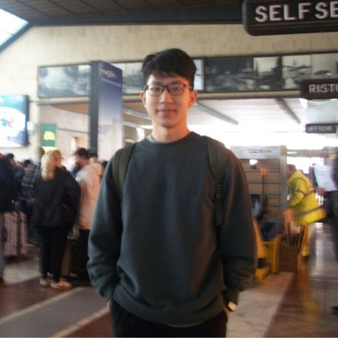
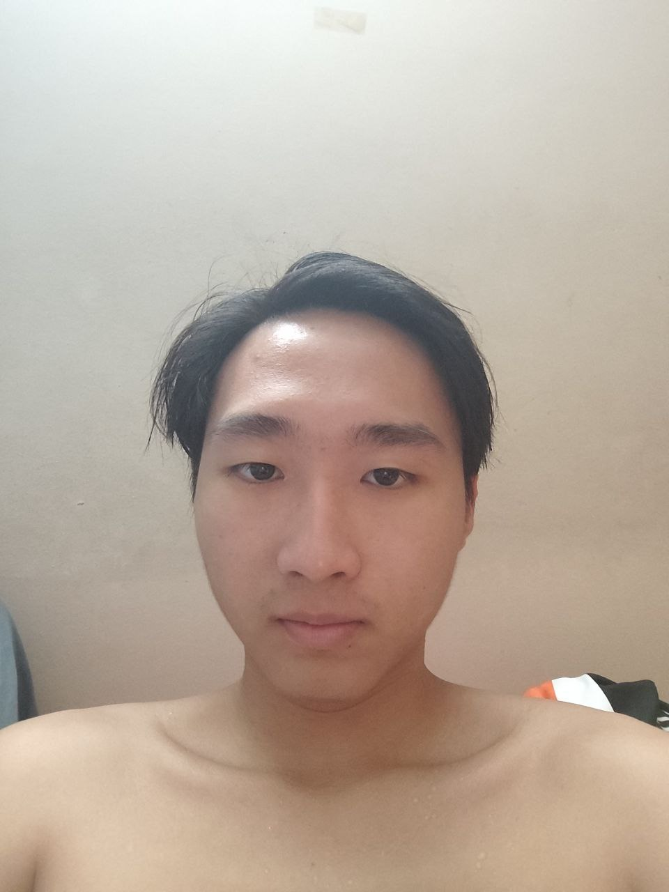

We are a team based in the [School of Computing, National University of Singapore](https://www.comp.nus.edu.sg).

You can reach us at the email `seer[at]comp.nus.edu.sg`

## Project team

### Aliensarefake

[[github](https://github.com/aliensarefake)]
[[portfolio](team/aliensarefake.md)]

* Role: Team Lead
* Responsibilities: Backend Architecture, API Development, Test Strategy, Code Quality

### Algebananazzzzz

[[github](http://github.com/algebananazzzzz)]
[[portfolio](team/algebananazzzzz.md)]

* Role: Developer
* Responsibilities: UI

### Don Lee Hong Hao

[[github](http://github.com/DonLeeHH)] [[portfolio](team/donleehh.md)]

- Role: Developer
- Responsibilities: Data

### John Doe

[[github](http://github.com/johndoe)]
[[portfolio](team/johndoe.md)]

- Role: Developer
- Responsibilities: Dev Ops + Threading

### Hon Yi Hao

[[github](http://github.com/yihao03)]
[[portfolio](team/yihao.md)]

* Role: Integration
* Responsibilities: In charge of versioning of the code, maintaining the code repository, integrating various parts of the software to create a whole.
