# TutBook Developer Guide

TutBook helps tuition centre administrators **manage students, tutors, parents, and classes efficiently**.  
It combines the speed of a **Command Line Interface (CLI)** with the convenience of a **Graphical User Interface (GUI)**, designed to streamline administrative tasks in a tuition centre.

This guide explains the **architecture, design decisions, implementation details, and testing strategy** behind TutBook. It also documents the rationale for major features, sequence diagrams, and proposed future enhancements.

* Table of Contents
{:toc}

---

## **Acknowledgements**

- Adapted the undo/redo mechanism from the original AB3 implementation as proposed features.
- Uses [JavaFX](https://openjfx.io/) for GUI rendering.
- Icons from [Material Design Icons](https://materialdesignicons.com/).
- Diagram styling adapted from [PlantUML Standard Library](https://plantuml.com/stdlib).

### AI Assistance Acknowledgement

Parts of this project were developed with assistance from AI tools (e.g., ChatGPT/Copilot/Claude Code).  
Specifically, AI was used for:
- Documentation proofreading and polishing
- Code debugging guidance
- Suggesting alternative implementations
- Generating and refining some test cases

All design and implementation decisions were made by our group, and AI-generated content was reviewed and adapted to ensure understanding and correctness.

---

## **Setting up, getting started**

Refer to the guide [_Setting up and getting started_](SettingUp.md).

---

## **Design**

<div markdown="span" class="alert alert-primary">

:bulb: **Tip:** The `.puml` files used to create diagrams are in this `docs/diagrams` folder. Refer to the [_PlantUML Tutorial_ at se-edu/guides](https://se-education.org/guides/tutorials/plantUml.html) to learn how to create and edit diagrams.

</div>

### Architecture

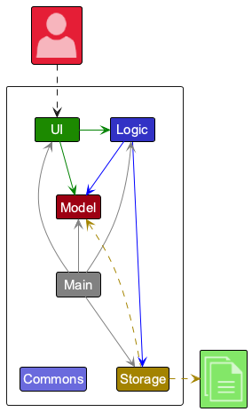

The **_Architecture Diagram_** given above explains the high-level design of the App.

Given below is a quick overview of main components and how they interact with each other.

**Main components of the architecture**

**`Main`** (consisting of classes [`Main`](https://github.com/AY2526S1-CS2103T-W09-3/tp/tree/master/src/main/java/seedu/address/Main.java) and [`MainApp`](https://github.com/AY2526S1-CS2103T-W09-3/tp/tree/master/src/main/java/seedu/address/MainApp.java)) is in charge of the app launch and shut down.

- At app launch, it initializes the other components in the correct sequence, and connects them up with each other.
- At shut down, it shuts down the other components and invokes cleanup methods where necessary.

The bulk of the app's work is done by the following four components:

- [**`UI`**](#ui-component): The UI of the App.
- [**`Logic`**](#logic-component): The command executor.
- [**`Model`**](#model-component): Holds the data of the App in memory.
- [**`Storage`**](#storage-component): Reads data from, and writes data to, the hard disk.

[**`Commons`**](#common-classes) represents a collection of classes used by multiple other components.

**How the architecture components interact with each other**


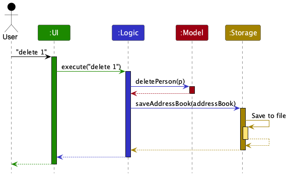

Each of the four main components (also shown in the diagram above),

- defines its _API_ in an `interface` with the same name as the Component.
- implements its functionality using a concrete `{Component Name}Manager` class (which follows the corresponding API `interface` mentioned in the previous point.

For example, the `Logic` component defines its API in the `Logic.java` interface and implements its functionality using the `LogicManager.java` class which follows the `Logic` interface. Other components interact with a given component through its interface rather than the concrete class (reason: to prevent outside component's being coupled to the implementation of a component), as illustrated in the (partial) class diagram below.

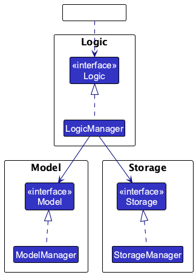

The sections below give more details of each component.

### UI component

The **API** of this component is specified in [`Ui.java`](https://github.com/AY2526S1-CS2103T-W09-3/tp/tree/master/src/main/java/seedu/address/ui/Ui.java)

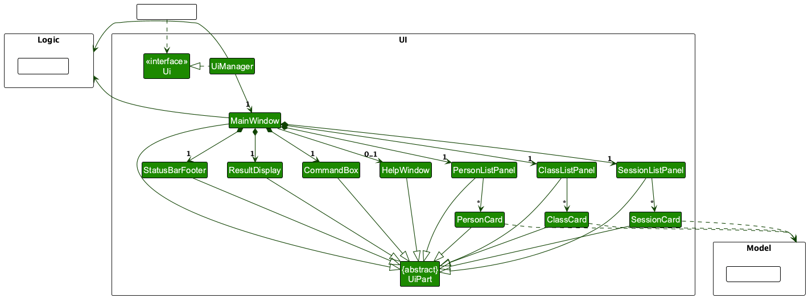

The UI consists of a `MainWindow` that is made up of parts e.g.`CommandBox`, `ResultDisplay`, `PersonListPanel`, `ClassListPanel`, `SessionListPanel`, `StatusBarFooter` etc. All these, including the `MainWindow`, inherit from the abstract `UiPart` class which captures the commonalities between classes that represent parts of the visible GUI.

The `UI` component uses the JavaFx UI framework. The layout of these UI parts are defined in matching `.fxml` files that are in the `src/main/resources/view` folder. For example, the layout of the [`MainWindow`](https://github.com/AY2526S1-CS2103T-W09-3/tp/tree/master/src/main/java/seedu/address/ui/MainWindow.java) is specified in [`MainWindow.fxml`](https://github.com/AY2526S1-CS2103T-W09-3/tp/tree/master/src/main/resources/view/MainWindow.fxml)

The `UI` component,

- executes user commands using the `Logic` component.
- listens for changes to `Model` data so that the UI can be updated with the modified data.
- keeps a reference to the `Logic` component, because the `UI` relies on the `Logic` to execute commands.
- depends on some classes in the `Model` component, as it displays `Person`, `TuitionClass`, and `ClassSession` objects residing in the `Model`.

**Key UI Panels:**
- `PersonListPanel` displays a list of persons (students, tutors, parents) using `PersonCard` components.
- `ClassListPanel` displays a list of tuition classes with their enrolled students and assigned tutors using `ClassCard` components.
- `SessionListPanel` displays a list of class sessions with their date, time, location, and attendance information using `SessionCard` components.

### Logic component

**API** : [`Logic.java`](https://github.com/AY2526S1-CS2103T-W09-3/tp/tree/master/src/main/java/seedu/address/logic/Logic.java)

Here's a (partial) class diagram of the `Logic` component:

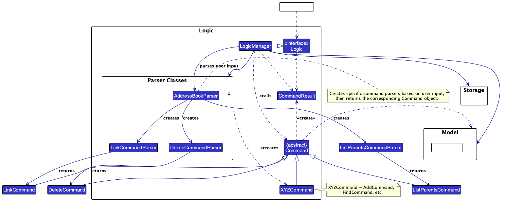

The sequence diagram below illustrates the interactions within the `Logic` component, taking `execute("delete 1")` API call as an example.


<div markdown="span" class="alert alert-info">:information_source: **Note:** The lifeline for `DeleteCommandParser` should end at the destroy marker (X) but due to a limitation of PlantUML, the lifeline continues till the end of diagram.
</div>

How the `Logic` component works:

1. When `Logic` is called upon to execute a command, it is passed to an `AddressBookParser` object which in turn creates a parser that matches the command (e.g., `DeleteCommandParser`) and uses it to parse the command.
1. This results in a `Command` object (more precisely, an object of one of its subclasses e.g., `DeleteCommand`) which is executed by the `LogicManager`.
1. The command can communicate with the `Model` when it is executed (e.g. to delete a person).<br>
   Note that although this is shown as a single step in the diagram above (for simplicity), in the code it can take several interactions (between the command object and the `Model`) to achieve.
1. The result of the command execution is encapsulated as a `CommandResult` object which is returned back from `Logic`.

Here are the other classes in `Logic` (omitted from the class diagram above) that are used for parsing a user command:

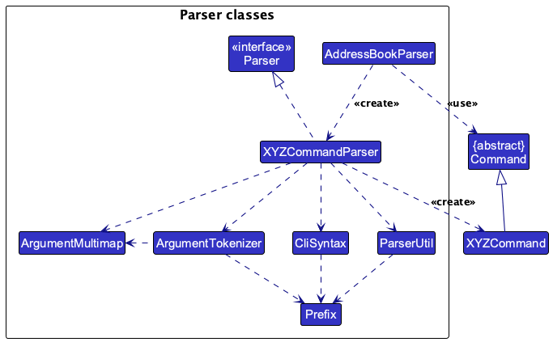

**Additional concrete commands and parsers:**

- `ListSessionCommand`, `ListSessionCommandParser` (command word: `listsessions`)
- `ViewSessionCommand`, `ViewSessionCommandParser` (command word: `viewsession`)
- `ListStudentsCommand`, `ListStudentsCommandParser` (command word: `liststudents`)
- `UnjoinClassCommand`, `UnjoinClassCommandParser` (command word: `unjoin`)
- `JoinClassCommand`, `JoinClassCommandParser` (command word: `join`)
- `AddSessionCommand`, `AddSessionCommandParser` (command word: `addsession`)
- `DeleteSessionCommand`, `DeleteSessionCommandParser` (command word: `deletesession`)
- `AttendCommand`, `AttendCommandParser` (command word: `attend`)
- `ListClassCommand`, `ListClassCommandParser` (command word: `listclass`)
- `ListParentsCommand`, `ListParentsCommandParser` (command word: `parentsof`)
- `ListChildrenCommand`, `ListChildrenCommandParser` (command word: `childrenof`)
- `EditClassCommand`, `EditClassCommandParser` (command word: `editclass`)
- `DeleteClassCommand`, `DeleteClassCommandParser` (command word: `deleteclass`)
- `AddClassCommand`, `AddClassCommandParser` (command word: `addclass`)
- `LinkCommand`, `LinkCommandParser` (command word: `link`)


### Model component

**API** : [`Model.java`](https://github.com/AY2526S1-CS2103T-W09-3/tp/tree/master/src/main/java/seedu/address/model/Model.java)

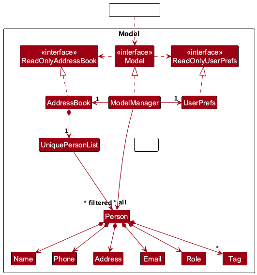

The `Model` component,

- stores the address book data i.e., all `Person` objects (which are contained in a `UniquePersonList` object).
- stores the currently 'selected' `Person` objects (e.g., results of a search query) as a separate _filtered_ list which is exposed to outsiders as an unmodifiable `ObservableList<Person>` that can be 'observed' e.g. the UI can be bound to this list so that the UI automatically updates when the data in the list change.
- stores a `UserPref` object that represents the user's preferences. This is exposed to the outside as a `ReadOnlyUserPref` objects.
- does not depend on any of the other three components (as the `Model` represents data entities of the domain, they should make sense on their own without depending on other components)

<div markdown="span" class="alert alert-info">:information_source: **Note on Name Uniqueness:** The `UniquePersonList` enforces that each person must have a unique name. This means two persons cannot have identical names, even if they have different roles (e.g., student vs parent). If your use case requires managing individuals with the same name, users should differentiate them using suffixes or indexing (e.g., "John Tan (Father)" and "John Tan (Son)", or "John Tan 1" and "John Tan 2").
</div>

<div markdown="span" class="alert alert-info">:information_source: **Note:** An alternative (arguably, a more OOP) model is given below. It has a `Tag` list in the `TutBook`, which `Person` references. This allows `TutBook` to only require one `Tag` object per unique tag, instead of each `Person` needing their own `Tag` objects.<br>

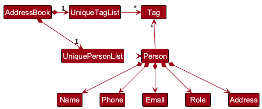

</div>

**Extended domain model (new):**

> TutBook introduces `TuitionClass` (with `students`, `tutors`, `sessions`) and `ClassSession` (per-session `attendance`). Relationships are validated by roles (`STUDENT`, `TUTOR`, `PARENT`). Attendance is stored per session as a map from student to `AttendanceStatus`.

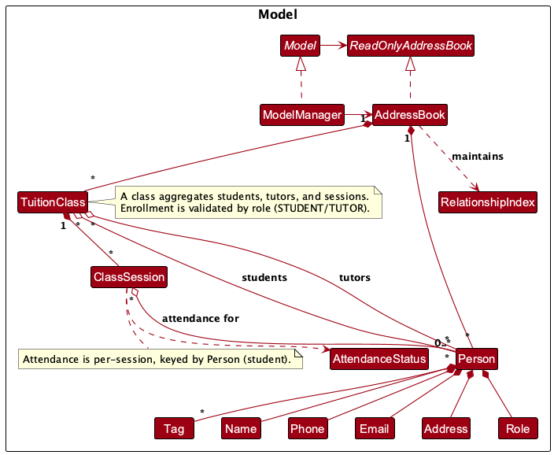

### Storage component

**API** : [`Storage.java`](https://github.com/AY2526S1-CS2103T-W09-3/tp/tree/master/src/main/java/seedu/address/storage/Storage.java)

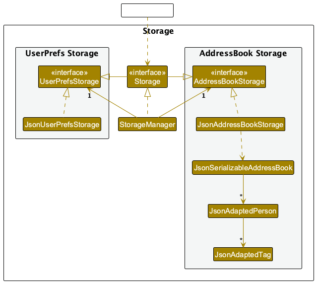

The `Storage` component,

- can save both address book data and user preference data in JSON format, and read them back into corresponding objects.
- inherits from both `AddressBookStorage` and `UserPrefStorage`, which means it can be treated as either one (if only the functionality of only one is needed).
- depends on some classes in the `Model` component (because the `Storage` component's job is to save/retrieve objects that belong to the `Model`)

**Extended JSON adapters (new):**

> Classes and sessions are serialized via `JsonAdaptedClass` and `JsonAdaptedSession`, with attendance encoded as a string map.

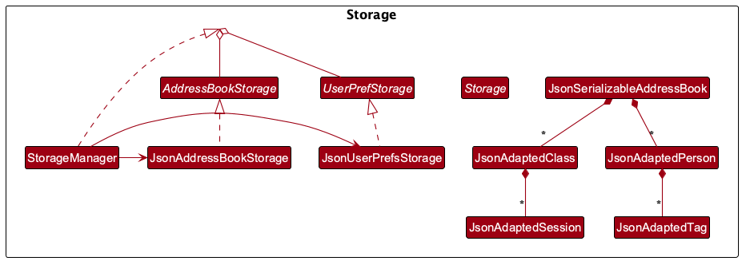

### Common classes

Classes used by multiple components are in the `seedu.address.commons` package.

---

## **Implementation**

This section describes some noteworthy details on how certain features are implemented.

### Class Enrollment (join / unjoin)

**Join** validates that the person is a `STUDENT`, prevents duplicate enrollment, updates the class roster, and persists changes.  
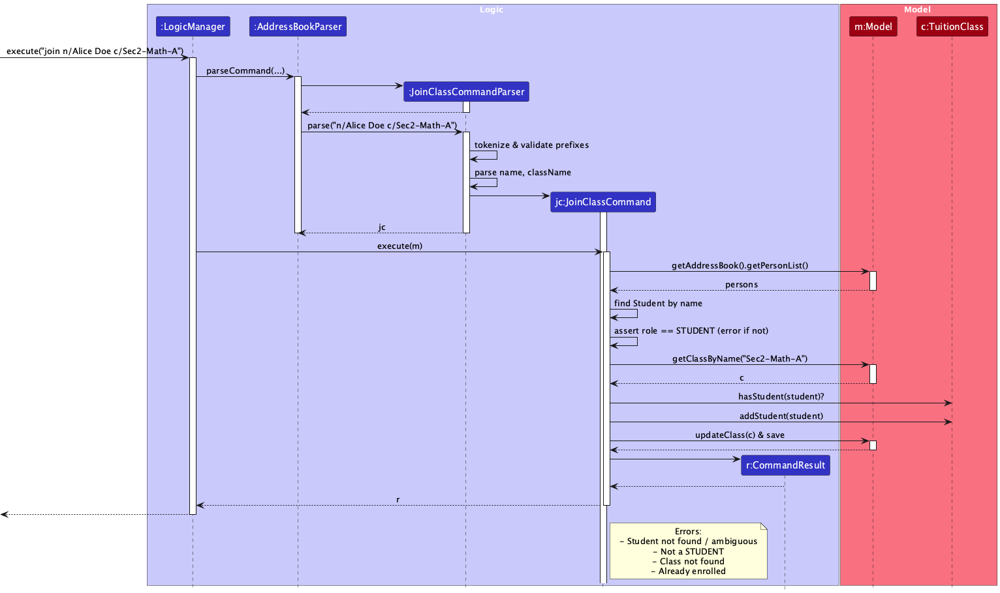

**Unjoin** removes a `STUDENT` or `TUTOR` from a class, with guardrails if not a member.  
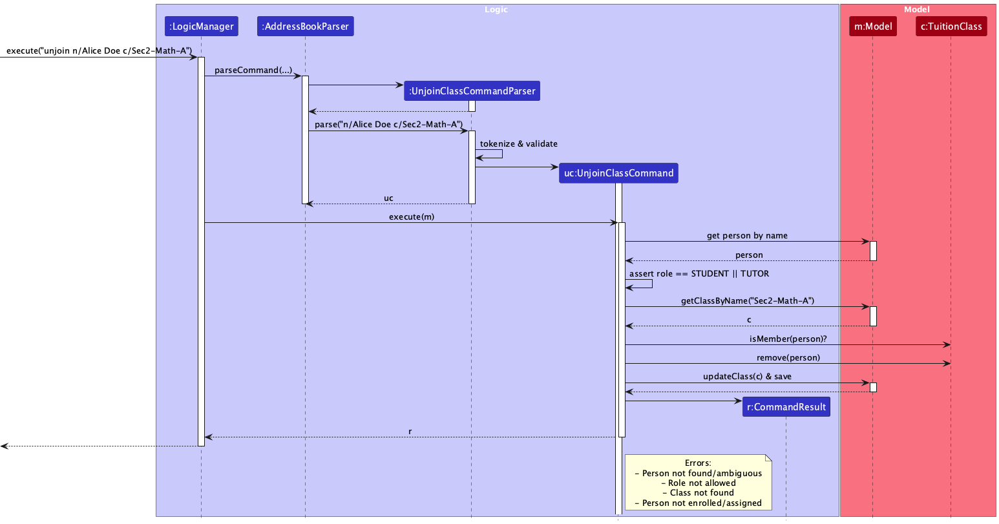

---

### Remove From Class Feature

#### Implementation

The remove-from-class feature provides the inverse operation of the join command, allowing removal of students and tutors from classes.

**Key Components**
- `UnjoinClassCommand` - Handles removal logic  
- Enhanced `TuitionClass` with removal methods for students and tutors  
- Cascade cleanup when a person is deleted (removed from all classes)

**Operations**
- Removes student from class enrollment  
- Removes tutor from class assignment  
- Validates person role & class membership before removal

**Sequence diagrams**

- Join to Class  
  

- Unjoin from Class  
  

- Delete Class (cascade)  
  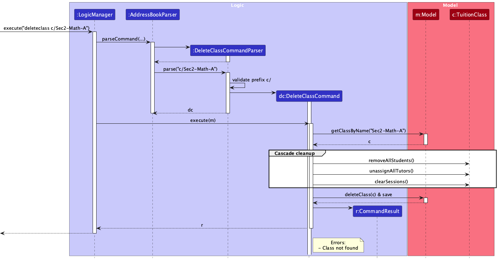

---

### Session Management

**Add session** enforces unique `sessionName` per class and saves date/time/location.  
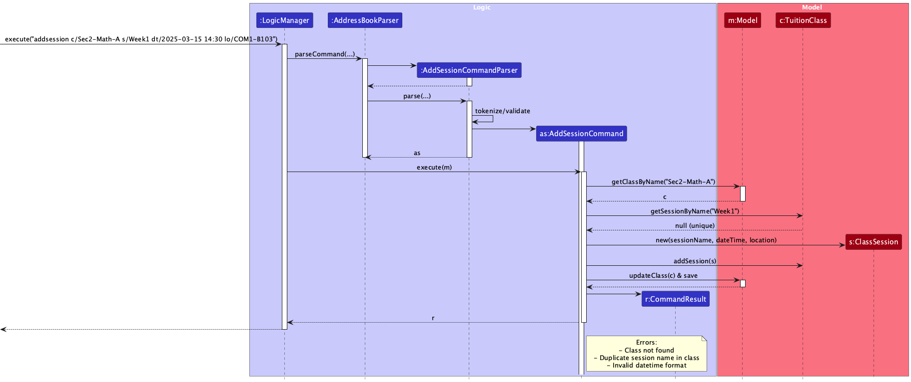

**Mark attendance** validates student enrollment and updates per-session attendance.  
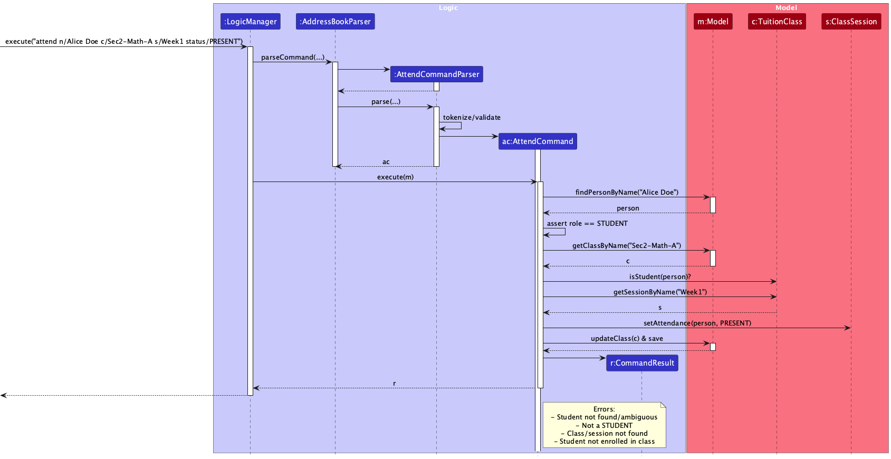

**View session** aggregates meta and attendance summary for display.  
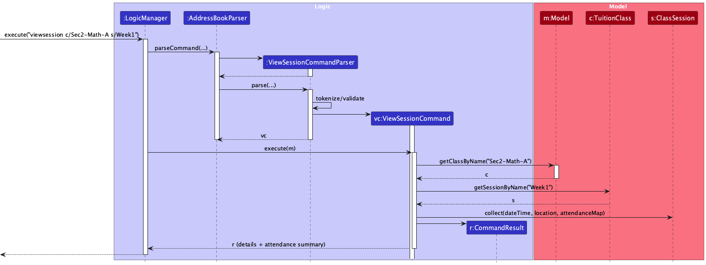

#### Implementation

The session management feature allows users to create, view, and manage class sessions with attendance tracking.

**Core Classes**
- `ClassSession` – Represents a single session with date/time, location, and attendance records  
- `TuitionClass` – Enhanced to store a list of sessions  
- `AddSessionCommand`, `DeleteSessionCommand`, `ViewSessionCommand`, `ListSessionCommand`

**Storage Implementation**
- Sessions are persisted via `JsonAdaptedSession`  
- Attendance per session stored as `studentName → PRESENT/ABSENT`

**Key Operations**
1. Adding a Session  
2. Marking Attendance per session  
3. Viewing Session details with attendance records  
4. Listing sessions for a class  
5. Listing students for attendance view

**Sequence diagrams**

- Add Session  
  

- Mark Attendance  
  

- View Session  
  

**List sessions for a class**
- Command: `listsessions c/CLASS_NAME`  
- Updates observable session list  
- Shows count or `[No sessions]`

**List students in a class**
- Command: `liststudents c/CLASS_NAME`  
- Filters left panel to only show enrolled students  

#### Design Considerations

**Aspect: Session Storage Structure**

- **Chosen:** Store sessions within each class  
  - Pros: clear ownership, easy class-scoped management  
  - Cons: traverse class to find sessions  

- **Alternative:** Standalone session store  
  - Pros: direct session access  
  - Cons: risk of orphan sessions, complexity

---

### Parent–Child Linking

Links are bidirectional and role-validated (`PARENT` ↔ `STUDENT`), with idempotency for already-linked pairs.  
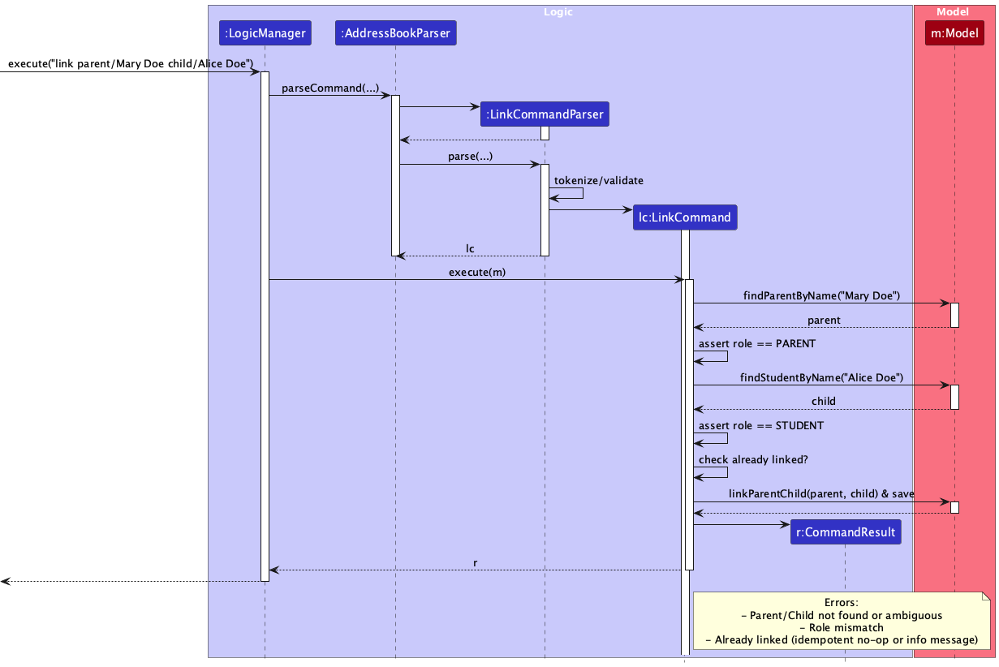

#### Parent Management Feature

Lists parents of a specific child.

**Key Components**
- `ListParentsCommand`  
- Model filtering for parent lookups

**Command format**
```
parentsof n/CHILD_NAME
```

#### Children Management Feature

Lists children of a specific parent.

**Key Components**
- `ListChildrenCommand`  
- Model filtering for child lookups

**Command format**
```
childrenof n/PARENT_NAME
```

---

### Deleting a Class

Deleting a class removes enrollments, unassigns tutors, and clears sessions before persisting.  


---

### Storage Extensions

Classes/sessions are serialized via `JsonAdaptedClass` and `JsonAdaptedSession`; attendance is a string map (`name → PRESENT/ABSENT`).  


---

### Enhanced Class Storage

#### Implementation

Classes now store comprehensive details including sessions and maintain persistent state across application restarts.

**Storage Enhancements**
- Classes store list of sessions and attendance records  
- Session metadata (date, time, location) preserved  
- Attendance history per student persisted

**JSON Structure**

```json
{
  "className": "Math101",
  "tutors": ["Ms. Lim"],
  "students": ["John Doe", "Jane Smith"],
  "sessions": [
    {
      "sessionName": "Week 1 Tutorial",
      "dateTime": "2024-03-15T14:30:00",
      "location": "COM1-B103",
      "attendanceRecords": {
        "John Doe": "PRESENT",
        "Jane Smith": "ABSENT"
      }
    }
  ]
}
```

This ensures all class-related data is cohesively stored and fully restored on app restart.

---

### \[Proposed\] Undo/redo feature

#### Proposed Implementation

The proposed undo/redo mechanism is facilitated by `VersionedAddressBook`. It extends `AddressBook` with an undo/redo history, stored internally as an `addressBookStateList` and `currentStatePointer`. Additionally, it implements the following operations:

- `VersionedAddressBook#commit()` — Saves the current address book state in its history.
- `VersionedAddressBook#undo()` — Restores the previous address book state from its history.
- `VersionedAddressBook#redo()` — Restores a previously undone address book state from its history.

These operations are exposed in the `Model` interface as `Model#commitAddressBook()`, `Model#undoAddressBook()` and `Model#redoAddressBook()` respectively.

Given below is an example usage scenario and how the undo/redo mechanism behaves at each step.

Step 1. The user launches the application for the first time. The `VersionedAddressBook` will be initialized with the initial address book state, and the `currentStatePointer` pointing to that single address book state.

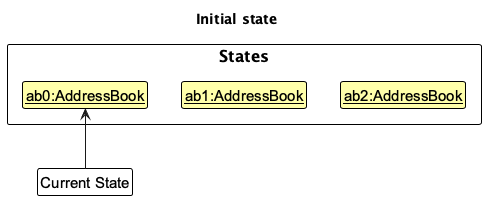

Step 2. The user executes `delete 5` command to delete the 5th person in the address book. The `delete` command calls `Model#commitAddressBook()`, causing the modified state of the address book after the `delete 5` command executes to be saved in the `addressBookStateList`, and the `currentStatePointer` is shifted to the newly inserted address book state.

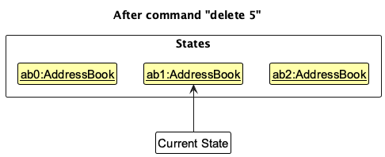

Step 3. The user executes `add n/David …​` to add a new person. The `add` command also calls `Model#commitAddressBook()`, causing another modified address book state to be saved into the `addressBookStateList`.

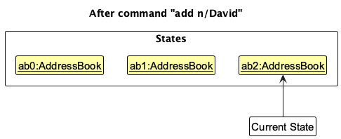

<div markdown="span" class="alert alert-info">:information_source: **Note:** If a command fails its execution, it will not call `Model#commitAddressBook()`, so the address book state will not be saved into the `addressBookStateList`.

</div>

Step 4. The user now decides that adding the person was a mistake, and decides to undo that action by executing the `undo` command. The `undo` command will call `Model#undoAddressBook()`, which will shift the `currentStatePointer` once to the left, pointing it to the previous address book state, and restores the address book to that state.

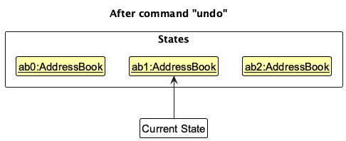

<div markdown="span" class="alert alert-info">:information_source: **Note:** If the `currentStatePointer` is at index 0, pointing to the initial AddressBook state, then there are no previous AddressBook states to restore. The `undo` command uses `Model#canUndoAddressBook()` to check if this is the case. If so, it will return an error to the user rather
than attempting to perform the undo.

</div>

The following sequence diagram shows how an undo operation goes through the `Logic` component:

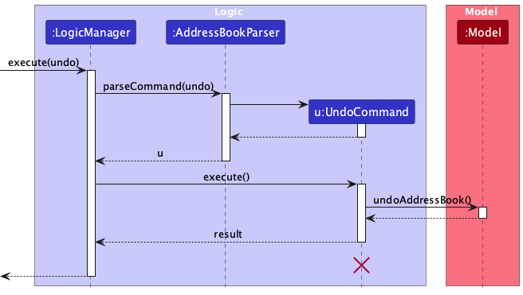

<div markdown="span" class="alert alert-info">:information_source: **Note:** The lifeline for `UndoCommand` should end at the destroy marker (X) but due to a limitation of PlantUML, the lifeline reaches the end of diagram.

</div>

Similarly, how an undo operation goes through the `Model` component is shown below:

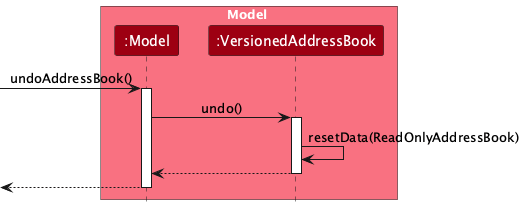

The `redo` command does the opposite — it calls `Model#redoAddressBook()`, which shifts the `currentStatePointer` once to the right, pointing to the previously undone state, and restores the address book to that state.

<div markdown="span" class="alert alert-info">:information_source: **Note:** If the `currentStatePointer` is at index `addressBookStateList.size() - 1`, pointing to the latest address book state, then there are no undone AddressBook states to restore. The `redo` command uses `Model#canRedoAddressBook()` to check if this is the case. If so, it will return an error to the user rather than attempting to perform the redo.

</div>

Step 5. The user then decides to execute the command `list`. Commands that do not modify the address book, such as `list`, will usually not call `Model#commitAddressBook()`, `Model#undoAddressBook()` or `Model#redoAddressBook()`. Thus, the `addressBookStateList` remains unchanged.

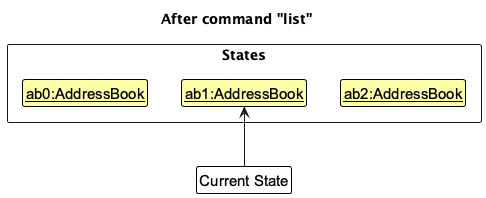

Step 6. The user executes `clear`, which calls `Model#commitAddressBook()`. Since the `currentStatePointer` is not pointing at the end of the `addressBookStateList`, all address book states after the `currentStatePointer` will be purged. Reason: It no longer makes sense to redo the `add n/David …​` command. This is the behavior that most modern desktop applications follow.

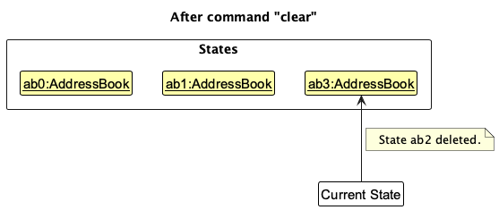

The following activity diagram summarizes what happens when a user executes a new command:

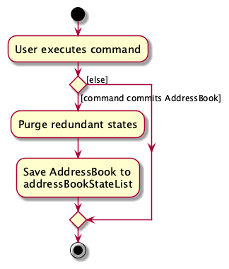

#### Design considerations

**Aspect: How undo & redo executes:**

- **Alternative 1 (current choice):** Saves the entire address book.
  - Pros: Easy to implement.
  - Cons: May have performance issues in terms of memory usage.

- **Alternative 2:** Individual command knows how to undo/redo by
  itself.
  - Pros: Will use less memory (e.g. for `delete`, just save the person being deleted).
  - Cons: We must ensure that the implementation of each individual command are correct.

---

## **Documentation, logging, testing, configuration, dev-ops**

- [Documentation guide](Documentation.md)
- [Testing guide](Testing.md)
- [Logging guide](Logging.md)
- [Configuration guide](Configuration.md)
- [DevOps guide](DevOps.md)

---

## **Appendix: Requirements**

### Product scope

**Target user profile**:

- Tuition centre administrators and managers
- has a need to manage a significant number of contacts (students, tutors, parents)
- needs to track relationships between different contact types
- manages class schedules and student-tutor assignments
- handles administrative tasks like attendance tracking and fee management
- prefer desktop apps over other types
- can type fast
- prefers typing to mouse interactions
- is reasonably comfortable using CLI apps
- values efficiency and comprehensive information access

**Value proposition**: Streamline tuition centre management by providing a centralized system to manage contacts, track relationships between students, tutors and parents, and access all critical information at a glance - all through an efficient CLI interface that's faster than traditional GUI applications

### User stories

Priorities: High (must have) - `* * *`, Medium (nice to have) - `* *`, Low (unlikely to have) - `*`

| Priority | As a …​         | I want to …​                                        | So that I can…​                                                         |
| -------- | --------------- | --------------------------------------------------- | ----------------------------------------------------------------------- |
| `* * *`  | first-time user | have clear list of commands                         | learn the features quickly                                              |
| `* * *`  | first-time user | have demo/sample data preloaded                     | explore features without starting from scratch                          |
| `* * *`  | admin           | add and delete contacts (students, tutors, parents) | maintain an up-to-date contact database                                 |
| `* * *`  | admin           | prevent duplicate student records when adding       | keep the data accurate                                                  |
| `* * *`  | admin           | update any contact's information                    | always have their latest details                                        |
| `* * *`  | admin           | view all contacts                                   | have easy access to all information                                     |
| `* * *`  | admin           | filter contacts by role (student/tutor/parent)      | quickly view specific groups of people                                  |
| `* * *`  | admin           | search for contacts by name                         | quickly locate specific people                                          |
| `* * *`  | admin           | link parents to students                            | establish and track family relationships                                |
| `* * *`  | admin           | view all children of a parent                       | see family groupings at a glance                                        |
| `* * *`  | admin           | create classes                                      | organize students and tutors into teaching groups                       |
| `* * *`  | admin           | assign tutors to classes                            | track which tutor is teaching each class                                |
| `* * *`  | admin           | add students to classes                             | manage class rosters efficiently                                        |
| `* * *`  | admin           | view all classes with enrolled students             | see the full class roster at a glance                                   |
| `* * *`  | admin           | rename classes                                      | keep class names current as terms progress                              |
| `* * *`  | admin           | delete classes                                      | remove outdated or cancelled classes                                    |
| `* * *`  | admin           | see role indicators for each contact                | quickly identify whether someone is a student, tutor, or parent         |
| `* *`    | admin           | link parents to multiple children                   | only need one contact profile to manage all tuition-related information |
| `* *`    | admin           | assign tutors to multiple classes                   | reflect real-world teaching responsibilities                            |
| `* *`    | admin           | record attendance for students                      | track student participation without separate sheets                     |
| `* *`    | admin           | add performance remarks to students' profiles       | monitor academic progress over time                                     |
| `* *`    | admin           | tag contacts with labels                            | categorize and organize contacts effectively                            |
| `* *`    | admin           | view class sessions                                 | keep track of scheduled lessons                                         |
| `* * *`  | admin           | add sessions to classes                             | schedule and organize class meetings                                    |
| `* * *`  | admin           | delete sessions from classes                        | remove cancelled or rescheduled sessions                                |
| `* * *`  | admin           | view detailed session information                   | see date, time, location, and attendance for each session               |
| `* * *`  | admin           | list all sessions for a class                       | get an overview of the class schedule                                   |
| `* * *`  | admin           | mark attendance for specific sessions               | maintain accurate attendance records per session                        |
| `* * *`  | admin           | remove students from classes                        | handle dropouts and class changes                                       |
| `* * *`  | admin           | remove tutors from classes                          | reassign teaching responsibilities                                      |
| `* *`    | admin           | list parents of specific children                   | identify who to contact for a student's issues                          |
| `*`      | admin           | import existing contact lists from Excel/CSV        | quickly set up the system without retyping data                         |
| `*`      | admin           | export the entire address book in JSON format       | back up the data safely                                                 |
| `*`      | admin           | merge duplicate contacts                            | maintain a clean and accurate address book                              |
| `*`      | admin           | track outstanding fees by parents                   | follow up with reminders                                                |
| `*`      | admin           | view monthly payout summaries                       | have transparency on how payments are calculated                        |
| `*`      | admin           | be warned if any classes clash                      | schedule classes without discrepancies                                  |

### Use cases

(For all use cases below, the **System** is the `TutBook` and the **Actor** is the `admin`, unless specified otherwise)

**Use case: UC01 - Add a new student**

**MSS**

1.  Admin enters command to add a new student with name, role, phone, and email
2.  TutBook validates the input data
3.  TutBook checks for duplicate contacts
4.  TutBook adds the student to the database
5.  TutBook displays success message with student details

    Use case ends.

**Extensions**

- 2a. Invalid input format (e.g., invalid phone number or email).
  - 2a1. TutBook shows an error message with the specific validation failure.

    Use case ends.

- 3a. Duplicate contact detected (same name and phone number).
  - 3a1. TutBook shows error message "Contact already exists. Cannot add duplicate."

    Use case ends.

**Use case: UC02 - Link parent to student**

**MSS**

1.  Admin enters command to link parent to student with their names
2.  TutBook searches for the parent by name
3.  TutBook searches for the student by name
4.  TutBook validates both contacts exist and have correct roles
5.  TutBook creates the bidirectional relationship link
6.  TutBook displays success message showing parent and child names

    Use case ends.

**Extensions**

- 2a. Parent not found.
  - 2a1. TutBook shows error message "Parent [name] not found."

    Use case ends.

- 2b. Multiple parents match the given name.
  - 2b1. TutBook shows error message "Multiple parents found with name [name]. Please be more specific."

    Use case ends.

- 3a. Student not found.
  - 3a1. TutBook shows error message "Child [name] not found."

    Use case ends.

- 3b. Multiple students match the given name.
  - 3b1. TutBook shows error message "Multiple children found with name [name]. Please be more specific."

    Use case ends.

- 4a. Parent contact is not of type PARENT.
  - 4a1. TutBook shows error message "Contact [name] is not a parent."

    Use case ends.

- 4b. Child contact is not of type STUDENT.
  - 4b1. TutBook shows error message "Contact [name] is not a student."

    Use case ends.

- 5a. Link already exists between parent and student.
  - 5a1. TutBook shows message "Parent [name] is already linked to child [name]."

    Use case ends.

**Use case: UC03 - Filter contacts by role**

**MSS**

1.  Admin enters filter command with role parameter (STUDENT/TUTOR/PARENT)
2.  TutBook filters the contact list by the specified role
3.  TutBook displays filtered list showing only contacts matching the role
4.  Admin views the filtered results

    Use case ends.

**Extensions**

- 1a. Invalid role specified.
  - 1a1. TutBook shows error message "Invalid role. Must be STUDENT, TUTOR, or PARENT."

    Use case ends.

- 2a. No contacts found with the specified role.
  - 2a1. TutBook displays empty list with message "0 persons listed!"

    Use case ends.

**Use case: UC04 - Record student attendance**

**MSS**

1.  Admin searches for the student by name
2.  TutBook displays the student's profile
3.  Admin enters attendance command with date and status (present/absent)
4.  TutBook validates the date format
5.  TutBook records the attendance
6.  TutBook displays confirmation message

    Use case ends.

**Extensions**

- 2a. Student not found.
  - 2a1. TutBook shows error message "Student not found."

    Use case ends.

- 4a. Invalid date format.
  - 4a1. TutBook shows error message "Date must be in YYYY-MM-DD format."

    Use case resumes at step 3.

- 5a. Attendance already recorded for this date.
  - 5a1. TutBook asks for confirmation to overwrite.
  - 5a2. Admin confirms or cancels.

    Use case ends.

**Use case: UC05 - Edit a contact**

**MSS**

1.  Admin searches for the contact by name or lists all contacts
2.  TutBook displays the contact(s)
3.  Admin enters edit command with contact index and new field values
4.  TutBook validates the new values
5.  TutBook updates the contact information
6.  TutBook displays success message with updated details

    Use case ends.

**Extensions**

- 2a. Contact not found.
  - 2a1. TutBook shows error message "Contact not found."

    Use case ends.

- 3a. Invalid index provided.
  - 3a1. TutBook shows error message "Invalid index. Please use a visible contact index."

    Use case resumes at step 3.

- 4a. Invalid field values (e.g., invalid email or phone format).
  - 4a1. TutBook shows specific validation error message.

    Use case resumes at step 3.

- 4b. Duplicate contact would be created (same name and phone as existing).
  - 4b1. TutBook shows error message "This change would create a duplicate contact."

    Use case resumes at step 3.

**Use case: UC06 - Delete a contact**

**MSS**

1.  Admin requests to list all contacts
2.  TutBook shows a list of contacts
3.  Admin requests to delete a specific contact by index or by name and phone
4.  TutBook deletes the contact
5.  TutBook displays confirmation message

    Use case ends.

**Extensions**

- 2a. The list is empty.

      Use case ends.

- 3a. The given index is invalid.
  - 3a1. TutBook shows error message "Invalid index. Please use a visible contact index."

    Use case resumes at step 2.

- 3b. Multiple contacts match the given name.
  - 3b1. TutBook shows error message "Multiple contacts match this name. Please specify phone number or use index."

    Use case resumes at step 2.

**Use case: UC07 - View children of a specific parent**

**MSS**

1.  Admin enters command to view children of a specific parent
2.  TutBook searches for the parent by name
3.  TutBook retrieves all students linked to this parent
4.  TutBook displays list of the parent's children

    Use case ends.

**Extensions**

- 2a. Parent not found.
  - 2a1. TutBook shows error message "Parent [name] not found."

    Use case ends.

- 3a. Parent has no children linked.
  - 3a1. TutBook shows message "[No children]"

    Use case ends.

**Use case: UC08 - Create a new class**

**MSS**

1.  Admin enters command to create a class with class name
2.  TutBook validates the class name is not empty and doesn't already exist
3.  TutBook creates the new class
4.  TutBook displays success message with class name

    Use case ends.

**Extensions**

- 2a. Class name already exists.
  - 2a1. TutBook shows error message "Class [name] already exists."

    Use case ends.

- 2b. Class name is empty or invalid format.
  - 2b1. TutBook shows error message about invalid class name format.

    Use case ends.

**Use case: UC09 - Create a new class with tutor assigned**

**MSS**

1.  Admin enters command to create a class with class name and tutor name
2.  TutBook validates the class name doesn't already exist
3.  TutBook searches for the tutor by name
4.  TutBook validates the contact is a tutor
5.  TutBook creates the new class and assigns the tutor
6.  TutBook displays success message with class and tutor names

    Use case ends.

**Extensions**

- 2a. Class name already exists.
  - 2a1. TutBook shows error message "Class [name] already exists."

    Use case ends.

- 3a. Tutor not found.
  - 3a1. TutBook shows error message "Tutor [name] not found."

    Use case ends.

- 3b. Multiple tutors match the given name.
  - 3b1. TutBook shows error message "Multiple tutors found with name [name]. Please be more specific."

    Use case ends.

- 4a. Contact is not of type TUTOR.
  - 4a1. TutBook shows error message "Contact [name] is not a tutor."

    Use case ends.

**Use case: UC11 - Add student to a class**

**MSS**

1.  Admin enters command to join student to class with student name and class name
2.  TutBook searches for the student by name
3.  TutBook validates the contact is a student
4.  TutBook searches for the class by name
5.  TutBook adds the student to the class
6.  TutBook displays success message

    Use case ends.

**Extensions**

- 2a. Student not found.
  - 2a1. TutBook shows error message "Student [name] not found."

    Use case ends.

- 2b. Multiple students match the given name.
  - 2b1. TutBook shows error message "Multiple students found with name [name]. Please be more specific."

    Use case ends.

- 3a. Contact is not of type STUDENT.
  - 3a1. TutBook shows error message "Contact [name] is not a student."

    Use case ends.

- 4a. Class not found.
  - 4a1. TutBook shows error message "Class [name] not found."

    Use case ends.

- 5a. Student is already enrolled in the class.
  - 5a1. TutBook shows message "Student [name] is already in class [class name]."

    Use case ends.

**Use case: UC12 - View all classes with enrolled students**

**MSS**

1.  Admin enters listclass command
2.  TutBook retrieves all classes in the system
3.  TutBook displays list of classes with their enrolled students and assigned tutors
4.  Admin views the complete class roster

    Use case ends.

**Extensions**

- 2a. No classes exist in the system.
  - 2a1. TutBook shows message "No classes found."

    Use case ends.

**Use case: UC13 - Rename a class**

**MSS**

1.  Admin enters command to rename class with old name and new name
2.  TutBook searches for the class by old name
3.  TutBook validates the new name doesn't already exist
4.  TutBook renames the class while maintaining all student enrollments and tutor assignments
5.  TutBook displays success message

    Use case ends.

**Extensions**

- 2a. Class with old name not found.
  - 2a1. TutBook shows error message "Class [old name] not found."

    Use case ends.

- 3a. Class with new name already exists.
  - 3a1. TutBook shows error message "Class [new name] already exists."

    Use case ends.

**Use case: UC14 - Delete a class**

**MSS**

1.  Admin enters command to delete class with class name
2.  TutBook searches for the class by name
3.  TutBook removes all student enrollments and tutor assignments
4.  TutBook deletes the class
5.  TutBook displays success message

    Use case ends.

**Extensions**

- 2a. Class not found.
  - 2a1. TutBook shows error message "Class [name] not found."

    Use case ends.

**Use case: UC15 - Add a session to a class**

**MSS**

1.  Admin enters command to add session with class name, session name, date/time, and optional location
2.  TutBook searches for the class by name
3.  TutBook validates the session name is unique within the class
4.  TutBook creates the new session with specified details
5.  TutBook displays success message with session details

    Use case ends.

**Extensions**

- 2a. Class not found.
  - 2a1. TutBook shows error message "Class [name] not found."

    Use case ends.

- 3a. Session with same name already exists in the class.
  - 3a1. TutBook shows error message "Session [name] already exists for this class."

    Use case ends.

**Use case: UC16 - Mark attendance for a session**

**MSS**

1.  Admin enters command to mark attendance with student name, class name, session name, and status
2.  TutBook searches for the student by name
3.  TutBook searches for the class by name
4.  TutBook searches for the session within the class
5.  TutBook verifies student is enrolled in the class
6.  TutBook updates attendance record for the student in the session
7.  TutBook displays success message

    Use case ends.

**Extensions**

- 2a. Student not found.
  - 2a1. TutBook shows error message "Student [name] not found."

    Use case ends.

- 3a. Class not found.
  - 3a1. TutBook shows error message "Class [name] not found."

    Use case ends.

- 4a. Session not found.
  - 4a1. TutBook shows error message "Session [name] not found in class."

    Use case ends.

- 5a. Student not enrolled in class.
  - 5a1. TutBook shows error message "Student [name] is not enrolled in class [name]."

    Use case ends.

**Use case: UC17 - View session details**

**MSS**

1.  Admin enters command to view session with class name and session name
2.  TutBook searches for the class by name
3.  TutBook searches for the session within the class
4.  TutBook retrieves session details (date, time, location)
5.  TutBook retrieves attendance records for all enrolled students
6.  TutBook displays session information and attendance summary

    Use case ends.

**Extensions**

- 2a. Class not found.
  - 2a1. TutBook shows error message "Class [name] not found."

    Use case ends.

- 3a. Session not found.
  - 3a1. TutBook shows error message "Session [name] not found in class."

    Use case ends.

**Use case: UC18 - Remove student from class**

**MSS**

1.  Admin enters command to remove student with student name and class name
2.  TutBook searches for the student by name
3.  TutBook searches for the class by name
4.  TutBook verifies student is enrolled in the class
5.  TutBook removes student from class enrollment
6.  TutBook displays success message

    Use case ends.

**Extensions**

- 2a. Student not found.
  - 2a1. TutBook shows error message "Student [name] not found."

    Use case ends.

- 3a. Class not found.
  - 3a1. TutBook shows error message "Class [name] not found."

    Use case ends.

- 4a. Student not enrolled in class.
  - 4a1. TutBook shows error message "Student [name] is not enrolled in class [name]."

    Use case ends.

**Use case: UC19 - List parents of a child**

**MSS**

1.  Admin enters command to list parents of a specific child
2.  TutBook searches for the child by name
3.  TutBook retrieves all linked parents for that child
4.  TutBook displays the parent(s) of the specified child

    Use case ends.

**Extensions**

- 2a. Child not found.
  - 2a1. TutBook shows error message "Child [name] not found."

    Use case ends.

- 3a. Child has no linked parents.
  - 3a1. TutBook shows message "No parents found for [child name]."

    Use case ends.

**Use case: UC20 - List sessions for a class**

**MSS**

1. Admin enters `listsessions c/CLASS_NAME`
2. TutBook retrieves all sessions for the class
3. TutBook updates the sessions panel and shows a summary

**Extensions**

- 2a. Class not found → Error “Class [name] not found.”

**Use case: UC21 - List students in a class**

**MSS**

1. Admin enters `liststudents c/CLASS_NAME`
2. TutBook filters the Person list to the class roster
3. TutBook shows the number of students displayed

**Extensions**

- 2a. Class not found → Error “Class [name] not found.”
- 2b. Class has no students → Message “[No students in this class]”.

### Non-Functional Requirements

#### Performance Requirements

1. The system should respond to any user command within 2 seconds under normal load conditions
2. Should be able to hold up to 1000 contacts (combination of students, tutors, and parents) without noticeable sluggishness in performance for typical usage
3. Search operations should return results within 1 second for databases with up to 1000 contacts
4. The application should start up within 5 seconds on standard hardware

#### Usability Requirements

5. A user with above average typing speed for regular English text (i.e. not code, not system admin commands) should be able to accomplish most of the tasks faster using commands than using the mouse
6. New users should be able to learn basic operations (add, delete, search, view) within 15 minutes with the help documentation
7. Error messages should clearly indicate what went wrong and how to fix it
8. Command syntax should be consistent across all features

#### Compatibility Requirements

9. Should work on any _mainstream OS_ (Windows 10/11, macOS 10.14+, Ubuntu 20.04+) as long as it has Java `17` or above installed
10. Data files should be portable across different operating systems
11. The application should work on systems with minimum 4GB RAM and 100MB free disk space

#### Reliability Requirements

12. The system should not lose any data when terminated unexpectedly (e.g., power failure)
13. Data should be automatically saved after each successful command execution
14. The system should be able to recover from crashes without data loss (persistent storage)
15. The system should validate data integrity when loading saved files and reject corrupted data

#### Security Requirements

16. Contact information should be stored locally only (no cloud sync for privacy)
17. The application should not require administrative privileges to run
18. Data files should be stored in a user-accessible format (JSON) but with data validation on load

#### Scalability Requirements

19. The architecture should support future addition of new contact types without major restructuring
20. The system should handle batch operations efficiently when processing multiple contacts simultaneously
21. Database design should allow for easy addition of new fields to existing contact types

#### Maintainability Requirements

22. Code should follow standard Java coding conventions
23. All public methods should have comprehensive JavaDoc documentation
24. Test coverage should be at least 70% for critical components
25. The application should use standard design patterns for extensibility

#### Portability Requirements

26. The application should be distributed as a single JAR file
27. No installation process should be required beyond having Java installed
28. User data should be stored in a platform-independent format (JSON)

#### Data Integrity Requirements

29. The system should prevent creation of orphaned relationships when contacts are deleted
30. All contact fields should be validated before saving to prevent data corruption
31. The system should maintain referential integrity between linked contacts (parent-student, tutor-student)

#### Accessibility Requirements

32. The application should support keyboard-only navigation
33. Font size in the UI should be readable (minimum 11pt)
34. Color schemes should have sufficient contrast for readability

### Glossary

- **Admin**: A tuition centre administrator or manager who uses TutBook to manage contacts and operations
- **Academic Year**: The year level of a student (e.g., Primary 1, Secondary 3, JC 1)
- **Class**: A scheduled tuition session with assigned tutor(s) and student(s) for a specific subject
- **CLI**: Command Line Interface - A text-based interface where users interact with the system through typed commands
- **Contact**: A person entry in TutBook, which can be a Student, Tutor, or Parent
- **CRUD**: Create, Read, Update, Delete - The four basic operations for managing data
- **Demo Data**: Pre-populated sample data provided for new users to explore TutBook features
- **Duplicate Contact**: A contact entry that has the same name AND phone number as an existing contact
- **Enrolled Subjects**: The subjects that a student is taking tuition for
- **Filter**: A search operation that shows only contacts matching specific criteria (e.g., role, subject)
- **JSON**: JavaScript Object Notation - A lightweight data format used for storing and exchanging data
- **Link**: A relationship connection between different contact types (e.g., parent-student, tutor-student)
- **Mainstream OS**: Windows, Linux, Unix, MacOS
- **MSS**: Main Success Scenario - The normal flow of events in a use case where nothing goes wrong
- **Parent**: A contact type representing the parent or guardian of a student
- **Performance Remarks**: Notes about a student's academic progress and areas needing improvement
- **Role**: The type of contact - Student, Tutor, or Parent
- **Student**: A contact type representing someone receiving tuition
- **Subject**: An academic subject taught at the tuition centre (e.g., Mathematics, English, Physics)
- **Tag**: A label attached to contacts for categorization (e.g., "Exam Prep", "Needs Support")
- **Tuition Centre**: An educational institution providing supplementary academic instruction
- **Tutor**: A contact type representing a teacher at the tuition centre
- **TutBook**: The address book application specifically designed for tuition centre management
- **Validation**: The process of checking if user input meets the required format and constraints

---

### Requirements implemented in the current version (v1.5)

| ID | Requirement | Type | How it is implemented |
|:--|:--|:--|:--|
| FR-1 | Add and delete contacts (students, tutors, parents) | Functional | `add`, `delete` commands manage contact creation and removal via `UniquePersonList`. |
| FR-2 | Link parents to students | Functional | `link` command validates roles and adds bidirectional relationship. |
| FR-3 | Filter contacts by role | Functional | `filter` command updates filtered list in `Model` based on role. |
| FR-4 | Create classes and assign tutors | Functional | `addclass` creates `TuitionClass`, assigns tutor if provided. |
| FR-5 | Join and unjoin students from classes | Functional | `join` / `unjoin` commands modify class rosters with role validation. |
| FR-6 | Add, view, and delete sessions | Functional | `addsession`, `viewsession`, `deletesession` operate on `ClassSession` objects. |
| FR-7 | Mark attendance per session | Functional | `attend` command updates attendance map in `ClassSession`. |
| FR-8 | Cascade cleanup when deleting class or person | Functional | `ModelManager` handles referential integrity for parent-child and class links. |
| FR-9 | Persistent local storage | Non-Functional | Implemented in `JsonAddressBookStorage`, auto-save after each command. |
| FR-10 | Cross-platform desktop CLI | Non-Functional | Java 17 + JavaFX GUI, works on Win/macOS/Linux. |

### Requirements yet to be implemented

| ID | Requirement | Status | Planned Implementation |
|:--|:--|:--|:--|
| FR-11 | Undo / Redo feature | Proposed | `VersionedAddressBook` with bounded history (see Planned Enhancements). |
| FR-12 | Data archiving / restore snapshots | Proposed | `ArchiveManager` to create timestamped JSON backups. |
| FR-13 | Search by partial keyword / tag | Backlog | Extend `FindCommand` to use substring matching. |
| FR-14 | Attendance statistics dashboard | Backlog | Aggregate attendance rate per class for UI display. |
| FR-15 | Auto daily backup policy | Planned | Integrate with archiving scheduler. |

---

## **Appendix: Instructions for manual testing**

Given below are instructions to test the app manually.

<div markdown="span" class="alert alert-info">:information_source: **Note:** These instructions only provide a starting point for testers to work on;
testers are expected to do more *exploratory* testing.

</div>

### Launch and shutdown

1. Initial launch
   1. Download the jar file and copy into an empty folder

   1. Double-click the jar file. Expected: Shows the GUI with a set of sample contacts. The window size may not be optimum.

1. Saving window preferences
   1. Resize the window to an optimum size. Move the window to a different location. Close the window.

   1. Re-launch the app by double-clicking the jar file.<br>
      Expected: The most recent window size and location is retained.

### Adding a person

1. Adding a person with all required fields
   1. Test case: `add n/John Doe p/98765432 e/johnd@example.com a/311, Clementi Ave 2 ro/student`<br>
      Expected: New student contact is added to the list. Success message shows the added contact details with role displayed as a colored chip.

   1. Test case: `add n/Jane Smith p/87654321 e/janes@example.com a/123 Main St ro/tutor`<br>
      Expected: New tutor contact is added. Success message displayed.

   1. Test case: `add n/Bob Lee p/91234567 e/bobl@example.com a/456 Park Ave ro/parent`<br>
      Expected: New parent contact is added. Success message displayed.

1. Adding a person with invalid or missing fields
   1. Test case: `add n/John p/invalid e/johnd@example.com a/311, Clementi Ave 2 ro/student`<br>
      Expected: No person is added. Error message about invalid phone number format is shown.

   1. Test case: `add n/John p/98765432 e/invalid-email a/311, Clementi Ave 2 ro/student`<br>
      Expected: No person is added. Error message about invalid email format is shown.

   1. Test case: `add n/John Doe p/98765432 e/johnd@example.com a/311, Clementi Ave 2 ro/invalid`<br>
      Expected: No person is added. Error message about invalid person type is shown.

   1. Test case: `add n/John Doe p/98765432`<br>
      Expected: No person is added. Error message about missing required fields is shown.

1. Adding a duplicate person
   1. Prerequisites: A contact with name "John Doe" already exists in the address book.

   1. Test case: `add n/John Doe p/98765432 e/different@example.com a/Different Address ro/student`<br>
      Expected: No person is added. Error message states "Contact already exists. Cannot add duplicate."

   1. Test case: `add n/John Doe p/99999999 e/another@example.com a/Another Address ro/parent`<br>
      Expected: No person is added, even though the role is different. Error message states "Contact already exists. Cannot add duplicate."

   1. Note: Name uniqueness is enforced across all roles. To add individuals with the same real name but different roles, use suffixes (e.g., "John Doe (Father)" and "John Doe (Son)").

### Filtering contacts by role

1. Filtering by student role
   1. Prerequisites: Address book contains multiple contacts of different types.

   1. Test case: `filter ro/student`<br>
      Expected: Only students are displayed in the list. Success message shows number of students listed.

   1. Test case: `filter ro/STUDENT` (case insensitive)<br>
      Expected: Same as above. Only students displayed.

1. Filtering by other roles
   1. Test case: `filter ro/tutor`<br>
      Expected: Only tutors are displayed.

   1. Test case: `filter ro/parent`<br>
      Expected: Only parents are displayed.

1. Invalid filter commands
   1. Test case: `filter ro/invalid`<br>
      Expected: No filtering occurs. Error message about invalid role is shown.

   1. Test case: `filter`<br>
      Expected: Error message about missing role parameter.

### Linking parent to child

1. Linking a valid parent to a valid student
   1. Prerequisites:
      - A parent contact "Mary Doe" exists
      - A student contact "Alice Doe" exists
      - They are not already linked

   1. Test case: `link parent/Mary Doe child/Alice Doe`<br>
      Expected: Parent and child are linked. Success message shows "Linked parent Mary Doe to child Alice Doe."

1. Invalid link operations
   1. Test case: `link parent/NonExistent Parent child/Alice Doe`<br>
      Expected: No link created. Error message states parent not found.

   1. Test case: `link parent/Mary Doe child/NonExistent Child`<br>
      Expected: No link created. Error message states child not found.

   1. Test case: `link parent/John Tutor child/Alice Doe` (where John Tutor is not a parent)<br>
      Expected: No link created. Error message states the contact is not a parent.

   1. Test case: `link parent/Mary Doe child/Bob Tutor` (where Bob Tutor is not a student)<br>
      Expected: No link created. Error message states the contact is not a student.

1. Linking already linked contacts
   1. Prerequisites: Mary Doe is already linked to Alice Doe.

   1. Test case: `link parent/Mary Doe child/Alice Doe`<br>
      Expected: No new link created. Message states they are already linked.

1. Attempting to link more than 2 parents to a child
   1. Prerequisites: Alice Doe already has 2 parents linked (e.g., Mary Doe and John Doe).

   1. Test case: `link parent/Jane Smith child/Alice Doe`<br>
      Expected: No new link created. Error message states "This child already has 2 parents linked. Cannot add more than 2 parents per child."

   1. Note: This constraint enforces a realistic parent-child relationship model, limiting each child to a maximum of 2 parents.

### Viewing children

1. Viewing children of a specific parent
   1. Prerequisites: Parent "Mary Doe" exists and has children linked.

   1. Test case: `childrenof n/Mary Doe`<br>
      Expected: All children of Mary Doe are displayed.

   1. Test case: `childrenof n/NonExistent Parent`<br>
      Expected: Error message states parent not found.

   1. Test case: `childrenof` (missing parent name)<br>
      Expected: Error message about invalid command format.

### Creating and managing classes

1. Creating a new class
   1. Test case: `addclass c/Math-101`<br>
      Expected: New class "Math-101" is created. Success message displayed.

   1. Test case: `addclass c/Physics-201 tutor/Mr. Smith` (where Mr. Smith is a tutor)<br>
      Expected: New class "Physics-201" is created with Mr. Smith as tutor. Success message displayed.

1. Creating a class with invalid parameters
   1. Prerequisites: Class "Math-101" already exists.

   1. Test case: `addclass c/Math-101`<br>
      Expected: No class created. Error message states class already exists.

   1. Test case: `addclass c/Physics-201 tutor/NonExistent Tutor`<br>
      Expected: No class created. Error message states tutor not found.

1. Adding students to a class
   1. Prerequisites:
      - Class "Math-101" exists
      - Student "Alice Doe" exists

   1. Test case: `join n/Alice Doe c/Math-101`<br>
      Expected: Alice Doe is added to Math-101. Success message displayed.

   1. Test case: `join n/NonExistent Student c/Math-101`<br>
      Expected: No student added. Error message states student not found.

   1. Test case: `join n/Alice Doe c/NonExistent Class`<br>
      Expected: No student added. Error message states class not found.

1. Listing all classes
   1. Prerequisites: At least one class exists in the system.

   1. Test case: `listclass`<br>
      Expected: All classes are displayed with their enrolled students and assigned tutors.

1. Renaming a class
   1. Prerequisites: Class "Math-101" exists and "Math-102" does not exist.

   1. Test case: `editclass o/Math-101 c/Math-102`<br>
      Expected: Class is renamed from Math-101 to Math-102. All student enrollments are maintained. Success message displayed.

   1. Test case: `editclass o/NonExistent c/Math-102`<br>
      Expected: No rename occurs. Error message states old class not found.

1. Deleting a class
   1. Prerequisites: Class "Math-101" exists.

   1. Test case: `deleteclass c/Math-101`<br>
      Expected: Class "Math-101" is deleted. All student enrollments are removed. Success message displayed.

   1. Test case: `deleteclass c/NonExistent`<br>
      Expected: No class deleted. Error message states class not found.

### Listing students in a class

1. Prerequisites: Class "Math-101" exists (may be empty).
1. Test case: `liststudents c/Math-101`<br>
   Expected: Left panel shows only enrolled students; message “Displaying X student(s) for class: Math-101” or “[No students in this class]”.
1. Test case: `liststudents c/NoSuchClass`<br>
   Expected: Error “Class not found: NoSuchClass”.

### Session Management

1. Adding a session to a class
   1. Prerequisites: Class "Math-101" exists.

   1. Test case: `addsession c/Math-101 s/Week 1 Tutorial dt/2024-03-15 14:30 lo/COM1-B103`<br>
      Expected: Session "Week 1 Tutorial" is added to Math-101 with the specified date/time and location. Success message displayed.

   1. Test case: `addsession c/Math-101 s/Week 2 Tutorial dt/2024-03-22 14:30`<br>
      Expected: Session "Week 2 Tutorial" is added without location. Success message displayed.

   1. Test case: `addsession c/NonExistent s/Session dt/2024-03-15 14:30`<br>
      Expected: No session created. Error message states class not found.

   1. Test case: `addsession c/Math-101 s/Week 1 Tutorial dt/2024-03-15 14:30` (duplicate session name)<br>
      Expected: No session created. Error message states session already exists.

1. Viewing session details
   1. Prerequisites:
      - Class "Math-101" exists with session "Week 1 Tutorial"
      - Students are enrolled in Math-101
      - Some attendance records exist

   1. Test case: `viewsession c/Math-101 s/Week 1 Tutorial`<br>
      Expected: Displays session details including date/time, location, and attendance status for all enrolled students.

   1. Test case: `viewsession c/Math-101 s/NonExistent Session`<br>
      Expected: Error message states session not found.

1. Listing all sessions
   1. Prerequisites: Class "Math-101" exists with multiple sessions.

   1. Test case: `listsessions c/Math-101`<br>
      Expected: All sessions for Math-101 are displayed chronologically with their details.

   1. Test case: `listsessions c/NonExistent`<br>
      Expected: Error message states class not found.

1. Marking attendance
   1. Prerequisites:
      - Class "Math-101" exists with session "Week 1 Tutorial"
      - Student "Alice Doe" is enrolled in Math-101

   1. Test case: `attend n/Alice Doe c/Math-101 s/Week 1 Tutorial status/PRESENT`<br>
      Expected: Alice Doe marked as present for the session. Success message displayed.

   1. Test case: `attend n/Alice Doe c/Math-101 s/Week 1 Tutorial status/ABSENT`<br>
      Expected: Alice Doe's attendance updated to absent. Success message displayed.

   1. Test case: `attend n/NonEnrolled Student c/Math-101 s/Week 1 Tutorial status/PRESENT`<br>
      Expected: Error message states student not enrolled in class.

1. Deleting a session
   1. Prerequisites: Class "Math-101" exists with session "Week 1 Tutorial".

   1. Test case: `deletesession c/Math-101 s/Week 1 Tutorial`<br>
      Expected: Session is deleted along with all attendance records. Success message displayed.

   1. Test case: `deletesession c/Math-101 s/NonExistent`<br>
      Expected: Error message states session not found.

### Parent Listing

1. Listing parents of a specific child
   1. Prerequisites:
      - Student "Alice Doe" exists
      - Parents "John Doe" and "Mary Doe" are linked to Alice

   1. Test case: `parentsof n/Alice Doe`<br>
      Expected: John Doe and Mary Doe are displayed as Alice's parents.

   1. Test case: `parentsof n/NonExistent Child`<br>
      Expected: Error message states child not found.

   1. Test case: `parentsof n/Bob Smith` (student with no parents)<br>
      Expected: Message indicates no parents found for Bob Smith.

   1. Test case: `parentsof` (missing child name)<br>
      Expected: Error message about invalid command format.

### Removing from Class

1. Removing a student from a class
   1. Prerequisites:
      - Class "Math-101" exists
      - Student "Alice Doe" is enrolled in Math-101

   1. Test case: `unjoin n/Alice Doe c/Math-101`<br>
      Expected: Alice Doe is removed from Math-101. Success message displayed.

   1. Test case: `unjoin n/Alice Doe c/Math-101` (already removed)<br>
      Expected: Error message states student not enrolled in class.

1. Removing a tutor from a class
   1. Prerequisites:
      - Class "Math-101" exists
      - Tutor "Mr. Smith" is assigned to Math-101

   1. Test case: `unjoin n/Mr. Smith c/Math-101`<br>
      Expected: Mr. Smith is unassigned from Math-101. Success message displayed.

   1. Test case: `unjoin n/NonExistent Person c/Math-101`<br>
      Expected: Error message states person not found.

### Deleting a person

1. Deleting a person while all persons are being shown
   1. Prerequisites: List all persons using the `list` command. Multiple persons in the list.

   1. Test case: `delete 1`<br>
      Expected: First contact is deleted from the list. Details of the deleted contact shown in the status message. All relationships (parent-child, class enrollments) are cleaned up.

   1. Test case: `delete 0`<br>
      Expected: No person is deleted. Error details shown in the status message.

   1. Other incorrect delete commands to try: `delete`, `delete x`, `...` (where x is larger than the list size)<br>
      Expected: Similar to previous.

1. Deleting a student with relationships
   1. Prerequisites:
      - Student "Alice Doe" at index 1 has a parent linked
      - Student is enrolled in at least one class

   1. Test case: `delete 1`<br>
      Expected: Student is deleted. Automatically removed from parent's children list and from all enrolled classes. Success message displayed.

1. Deleting a parent with children
   1. Prerequisites: Parent "Mary Doe" at index 1 has children linked.

   1. Test case: `delete 1`<br>
      Expected: Parent is deleted. Automatically removed from all children's parent lists. Success message displayed.

1. Deleting a tutor assigned to classes
   1. Prerequisites: Tutor "Mr. Smith" at index 1 is assigned to at least one class.

   1. Test case: `delete 1`<br>
      Expected: Tutor is deleted. Automatically unassigned from all classes. Success message displayed.

### Finding contacts

1. Finding contacts by name
   1. Prerequisites: Address book contains contacts including "Alice Doe", "Bob Lee", and "Alice Wang".

   1. Test case: `find Alice`<br>
      Expected: All contacts with "Alice" in their name are displayed (Alice Doe and Alice Wang).

   1. Test case: `find alice` (case insensitive)<br>
      Expected: Same as above.

   1. Test case: `find Alice Bob`<br>
      Expected: All contacts with "Alice" OR "Bob" in their name are displayed.

   1. Test case: `find NonExistentName`<br>
      Expected: No contacts displayed. Message shows "0 persons listed!"

### Editing a contact

1. Editing contact details
   1. Prerequisites: List all persons. First person in the list is a student.

   1. Test case: `edit 1 p/99999999`<br>
      Expected: First contact's phone number is updated to 99999999. Success message shows updated details.

   1. Test case: `edit 1 n/New Name e/newemail@example.com`<br>
      Expected: First contact's name and email are updated. Success message displayed.

   1. Test case: `edit 0 p/99999999`<br>
      Expected: No contact edited. Error message about invalid index.

   1. Test case: `edit 1` (no fields to edit)<br>
      Expected: No contact edited. Error message about at least one field to edit required.

### Saving data

1. Data persistence after commands
   1. Prerequisites: Application is running normally.

   1. Test case: Add a new contact, close the application, restart the application<br>
      Expected: The added contact is still present after restart.

   1. Test case: Delete a contact, close the application, restart the application<br>
      Expected: The deleted contact is not present after restart.

1. Dealing with corrupted data files
   1. Test case: Navigate to data folder, open addressbook.json, delete some closing braces to corrupt the JSON, restart the application<br>
      Expected: Application starts with empty data. Warning about corrupted data may be logged.

   1. Test case: Delete addressbook.json file, restart the application<br>
      Expected: Application starts with sample data preloaded.

---

## **Appendix: Planned Enhancements**

**Team size:** 5

| # | Enhancement | Current Limitation | Proposed Fix | Impact |
|:--|:--|:--|:--|:--|
| 1 | More specific error for invalid roles in `link` | Generic error message | Add role-based feedback ("Only a PARENT can link to a STUDENT") | Improved UX |
| 2 | Alphabetical sorting of classes | Unordered list output | Add `Comparator` in `Model#updateFilteredClassList()` | Better readability |
| 3 | Allow multiple tutors per class | One tutor only | Change `TuitionClass` → `List<Tutor>` | Realistic multi-tutor support |
| 4 | Edit session details (date/time) | Not editable | Add `editsession` command | Provides consistency and flexibility |
| 5 | Filter attendance by status | Always shows all | Add `status/` parameter in `viewsession` | Faster lookup |
| 6 | Display children in `listparents` | Not shown | Enhance `ListParentsCommand#format()` | Clearer relationships |
| 7 | Implement `archive` / `restorearchive` commands | No data versioning | Use `ArchiveManager` | Data safety |
| 8 | Implement Undo/Redo | Not available | Add `VersionedAddressBook` and `commit()` hooks | Error recovery |
| 9 | Prevent joining tutors as students | Possible by mistake | Add pre-check in `JoinCommand` | Data integrity |
| 10 | UI dark-mode theme | Visual inconsistency | Add CSS theme toggle | Accessibility |

---

## **Appendix: Effort**

### Overall difficulty
Compared to AB3, which manages a single entity (`Person`), TutBook introduces five inter-linked entities — `Student`, `Tutor`, `Parent`, `TuitionClass`, and `ClassSession` — each with its own constraints and bidirectional links. This raised design and testing complexity significantly.

### Technical challenges

| Area | Challenge | Resolution |
|:--|:--|:--|
| Model | Maintaining referential integrity when deleting classes or contacts | Implemented cascade cleanup in `ModelManager`. |
| Storage | Serialising nested objects (Class → Session → Attendance) | Created `JsonAdaptedClass` and `JsonAdaptedSession`. |
| Logic | Avoiding duplication across commands | Introduced `ClassCommandUtil` helper. |
| Parser | Supporting many prefixes (`c/`, `s/`, `status/`) | Extended `ArgumentTokenizer` to nested prefix structure. |
| Testing | Creating realistic linked test data | Added `TypicalClasses` and `TypicalSessions` fixtures. |

### Team effort
- 5 developers over 9 weeks, ~30 commits each.  
- ≈ 70 % of AB3 refactored or re-engineered.  
- CI/CD with GitHub Actions and Codecov for every PR.

### Code reuse and efficiency
- ~15 % of AB3 code reused (core parser/UI logic).  

### Achievements
- Delivered full multi-role contact management and session tracking.  
- Achieved > 80 % coverage in `logic`; > 80 % overall.  
- Extended DG/UG with new diagrams and testing sections.  
- Maintained consistent code style, peer reviews, and iteration deadlines.
