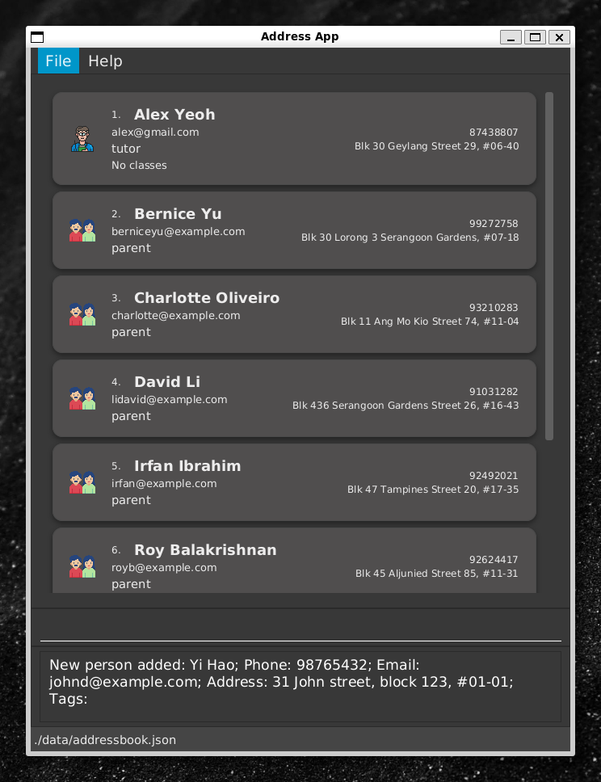
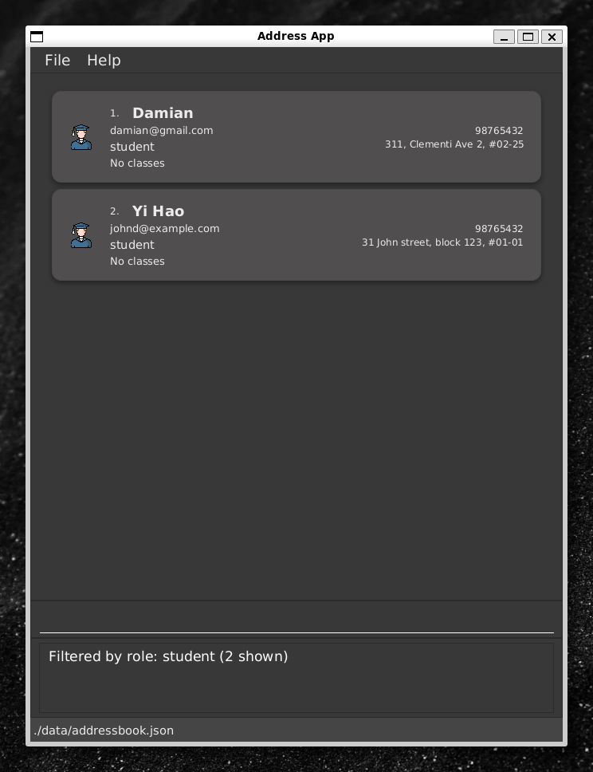
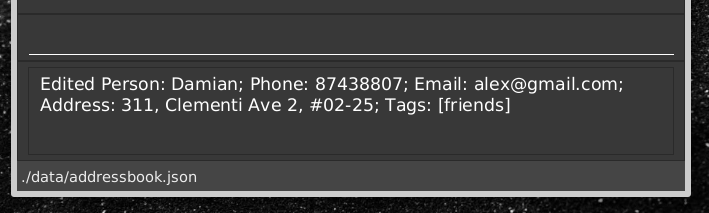

TutBook is a **desktop app for tuition centre admins to manage contacts, optimized for use via a Command Line Interface** (CLI) while still having the benefits of a Graphical User Interface (GUI). This release represents a significant enhancement over AB3, transforming it into a comprehensive tuition centre management system.

* Table of Contents
{:toc}

--------------------------------------------------------------------------------------------------------------------

## Quick start

1. Ensure you have Java `17` or above installed in your Computer. 
   Installation instructions can be found [here](https://www.java.com/en/download/help/download_options.html)  
   **Mac users:** Ensure you have the precise JDK version prescribed [here](https://se-education.org/guides/tutorials/javaInstallationMac.html).

1. Download the latest `.jar` file from [here](https://github.com/AY2526S1-CS2103T-W09-3/tp/releases).

1. Copy the file to the folder you want to use as the _home folder_ for your TutBook.

1. Open a command terminal, `cd` into the folder you put the jar file in, and use the `java -jar tutbook.jar` command to run the application. 
   A GUI similar to the below should appear in a few seconds. Note how the app contains some sample data. 
   

1. Type the command in the command box and press Enter to execute it. e.g. typing **`help`** and pressing Enter will open the help window. 
   Some example commands you can try:

   * `list` : Lists all contacts.

   * `listclass` : Lists all classes.

   * `add n/John Doe p/98765432 e/johnd@example.com a/John street, block 123, #01-01 ro/student` : Adds a student named `John Doe` to the Address Book.

   * `delete 3` : Deletes the 3rd contact shown in the current list.

   * `clear` : Deletes all contacts.

   * `exit` : Exits the app.

1. Refer to the [Features](#features) below for details of each command.

--------------------------------------------------------------------------------------------------------------------

## Features

**:information_source: Notes about the command format:** 

* Words in `UPPER_CASE` are the parameters to be supplied by the user. 
  e.g. in `add n/NAME`, `NAME` is a parameter which can be used as `add n/John Doe`.

* Items in square brackets are optional. 
  e.g `n/NAME [t/TAG]` can be used as `n/John Doe t/friend` or as `n/John Doe`.

* Items with `…`​ after them can be used multiple times including zero times. 
  e.g. `[t/TAG]…​` can be used as ` ` (i.e. 0 times), `t/friend`, `t/friend t/family` etc.

* Parameters can be in any order. 
  e.g. if the command specifies `n/NAME p/PHONE_NUMBER`, `p/PHONE_NUMBER n/NAME` is also acceptable.

* Extraneous parameters for commands that do not take in parameters (such as `help`, `list`, `listclass`, `exit` and `clear`) will be ignored. 
  e.g. if the command specifies `help 123`, it will be interpreted as `help`.

* If you are using a PDF version of this document, be careful when copying and pasting commands that span multiple lines as space characters surrounding line-breaks may be omitted when copied over to the application.

### Viewing help : `help`

Shows a message explaining how to access the help page.

Format: `help`

### Adding a person: `add`

Adds a person to the address book.

Format: `add n/NAME p/PHONE_NUMBER e/EMAIL a/ADDRESS ro/PERSON_TYPE [t/TAG]…​`

* `PERSON_TYPE` can be `student`, `tutor`, or `parent`

:bulb: **Tip:**
A person can have any number of tags (including 0)

Examples:

* `add n/Ms Lim p/91234567 e/mslim@example.com a/Clementi Ave 2 ro/tutor t/experienced`
* `add n/Yi Hao p/98765432 e/johnd@example.com a/31 John street, block 123, #01-01 ro/student`

### Listing all persons : `list`

Shows a list of all persons in the address book.

Format: `list`

### Filtering persons by role : `filter`

Filters and displays persons by their role (student, tutor, or parent).

Format: `filter ro/PERSON_TYPE`

* Shows only persons matching the specified role

:exclamation: **Caution:**
Commands like `edit` and `delete` operate on the index of the **currently displayed list**. After using `filter`, the indexes will change. For example, `delete 1` will delete the first person in the *filtered list*, not the first person in the main address book.

  

Examples:

* `filter ro/tutor` shows all tutors
* `filter ro/student` shows all students

### Editing a person : `edit`

Edits an existing person in the address book.

Format: `edit INDEX [n/NAME] [p/PHONE] [e/EMAIL] [a/ADDRESS] [t/TAG]…​`

* Edits the person at the specified `INDEX`. The index refers to the index number shown in the displayed person list. The index **must be a positive integer** 1, 2, 3, …​
* At least one of the optional fields must be provided.
* Existing values will be updated to the input values.
* When editing tags, the existing tags of the person will be removed i.e adding of tags is not cumulative.
* You can remove all the person’s tags by typing `t/` without
    specifying any tags after it.

Examples:

* `edit 1 p/87438807 e/alex@gmail.com` Edits the phone number and email address of the 1st person to be `87438807` and `alex@gmail.com` respectively.
* `edit 2 n/Betsy Crower t/` Edits the name of the 2nd person to be `Betsy Crower` and clears all existing tags.

### Locating persons by name: `find`

Finds persons whose names contain any of the given keywords.

Format: `find KEYWORD [MORE_KEYWORDS]`

* The search is case-insensitive. e.g `hans` will match `Hans`
* The order of the keywords does not matter. e.g. `Hans Bo` will match `Bo Hans`
* Only the name is searched.
* Only full words will be matched e.g. `Han` will not match `Hans`
* Persons matching at least one keyword will be returned (i.e. `OR` search).
  e.g. `Hans Bo` will return `Hans Gruber`, `Bo Yang`

Examples:

* `find John` returns `john` and `John Doe`
* `find david damian` returns `David Li`, `Damian` 
  

### Deleting a person : `delete`

Deletes the specified person from the address book.

Format: `delete INDEX`

* Deletes the person at the specified `INDEX`.
* The index refers to the index number shown in the displayed person list.
* The index **must be a positive integer** 1, 2, 3, …​

Examples:

* `list` followed by `delete 2` deletes the 2nd person in the address book.
* `find Betsy` followed by `delete 1` deletes the 1st person in the results of the `find` command.

### Linking a parent to a child : `link`

Links a parent to a student (child), establishing a parent-child relationship.

Format: `link parent/PARENT_NAME child/CHILD_NAME`

* Both parent and child must already exist in the address book
* The parent must have the role `parent` and the child must have the role `student`
* Names are case-sensitive

Examples:

* `link parent/Bernice Yu child/Damian` links parent Bernice Yu to child Damian

### Listing children : `childrenof`

Lists children of a specific parent.

Format: `childrenof n/PARENT_NAME`

* Displays all students linked to the specified parent

Example:

* `childrenof n/Bernice Yu` lists all children of Bernice Yu

### Adding a class : `addclass`

Adds a new tuition class to the system.

Format: `addclass c/CLASS_NAME [tu/TUTOR_NAME]`

* `CLASS_NAME` can contain spaces
* `TUTOR_NAME` is optional; if provided, the tutor must already exist in the address book

Examples:

* `addclass c/Sec2-Math-A` creates a class without a tutor
* `addclass c/CS2101 tu/Alex Yeoh` creates a class and assigns Alex Yeoh as the tutor

### Listing all classes : `listclass`

Lists all tuition classes with their enrolled students.

Format: `listclass`

### Editing a class : `editclass`

Renames an existing class.

Format: `editclass o/OLD_CLASS_NAME c/NEW_CLASS_NAME`

* Class names can contain spaces
* All students and tutor assignments are preserved

Examples:

* `editclass o/Sec3 Math c/Sec4 Math` renames the class from Sec3 Math to Sec4 Math

### Deleting a class : `deleteclass`

Deletes a class from the system.

Format: `deleteclass c/CLASS_NAME`

* Class name can contain spaces

Examples:

* `deleteclass c/Sec3-Math-A` deletes the class Sec3-Math-A

### Joining a class : `join`

Adds a student or tutor to a class.

Format: `join n/NAME c/CLASS`

* The person and class must already exist in the address book
* Students will be enrolled in the class
* Tutors will be assigned to teach the class

Examples:

* `join n/Damian c/Sec4 Math` enrolls student Damian in Sec4 Math
* `join n/Ms Lim c/Sec2-Math-A` assigns tutor Ms Lim to Sec2-Math-A

### Removing from a class : `unjoin`

Removes a student or tutor from a class.

Format: `unjoin n/NAME c/CLASS`

* The person must be enrolled or assigned to the class
* Works for both students and tutors

Examples:
* `unjoin n/Damian c/Sec4 Math` removes student Damian from Sec4 Math
* `unjoin n/Ms Lim c/Sec2-Math-A` removes tutor Ms Lim from Sec2-Math-A

### Adding a session : `addsession`

Adds a session to an existing class.

Format: `addsession c/CLASS_NAME s/SESSION_NAME dt/DATETIME [l/LOCATION]`

* The class must already exist
* `DATETIME` format: `YYYY-MM-DD HH:mm` (e.g., 2024-03-15 14:30)
* Location is optional
* Session names must be unique within a class

Examples:

* `addsession c/Math101 s/Week 3 Tutorial dt/2024-03-15 14:30 l/COM1-B103`
* `addsession c/Physics s/Lab Session 1 dt/2024-03-20 10:00`

### Deleting a session : `deletesession`

Removes a session from a class.

Format: `deletesession c/CLASS_NAME s/SESSION_NAME`

* The session must exist in the specified class
* All attendance records for the session will be deleted

Examples:

* `deletesession c/Math101 s/Week 3 Tutorial`
* `deletesession c/Physics s/Lab Session 1`

### Viewing a session : `viewsession`

Shows detailed information about a specific session, including attendance records.

Format: `viewsession c/CLASS_NAME s/SESSION_NAME`

* Displays session details (date, time, location)
* Shows attendance status for all enrolled students

Examples:

* `viewsession c/Math101 s/Week 3 Tutorial`
* `viewsession c/Physics s/Lab Session 1`

### Listing sessions : `listsession`

Lists all sessions for a specific class.

Format: `listsessions c/CLASS_NAME`

* Shows all sessions chronologically
* Displays date, time, and location for each session

Examples:
* `listsessions c/Math101`
* `listsessions c/Physics`

### Listing parents : `listparents`

Lists all parents or the parents of a specific child.

Format: `listparents [n/CHILD_NAME]`

* Without parameters, lists all parents in the system
* With a child's name, shows only that child's parents

Examples:

* `listparents` lists all parents
* `listparents n/Damian` lists Damian's parents

### Marking attendance : `attend`

Marks attendance for a student in a specific class session.

Format: `attend n/NAME c/CLASS_NAME s/SESSION_NAME st/STATUS`

* The student must be enrolled in the specified class
* The session must exist in the class
* `STATUS` must be either `PRESENT` or `ABSENT`
* Attendance records are persistent and can be viewed with `viewsession`

Examples:

* `attend n/John Doe c/Math101 s/Week 3 Tutorial st/PRESENT` marks John Doe as present
* `attend n/Jane Smith c/Physics s/Lab Session 1 st/ABSENT` marks Jane Smith as absent

### Clearing all entries : `clear`

Clears all entries from the address book.

Format: `clear`

### Exiting the program : `exit`

Exits the program.

Format: `exit`

### Saving the data

TutBook data are saved in the hard disk automatically after any command that changes the data. There is no need to save manually.

### Editing the data file

TutBook data are saved automatically as a JSON file `[JAR file location]/data/addressbook.json`. Advanced users are welcome to update data directly by editing that data file.

:exclamation: **Caution:**
If your changes to the data file makes its format invalid, TutBook will discard all data and start with an empty data file at the next run. Hence, it is recommended to take a backup of the file before editing it. 
Furthermore, certain edits can cause the TutBook to behave in unexpected ways (e.g., if a value entered is outside of the acceptable range). Therefore, edit the data file only if you are confident that you can update it correctly.

### Archiving data files `[coming in v2.0]`

_Details coming soon ..._

--------------------------------------------------------------------------------------------------------------------

## FAQ

**Q**: How do I transfer my data to another Computer? 
**A**: Install the app in the other computer and overwrite the empty data file it creates with the file that contains the data of your previous TutBook home folder. 

**Q**: Can I undo a delete or clear command? 
**A**: No. All destructive commands (like `delete`, `deleteclass`, and `clear`) are irreversible and cannot be undone. 

**Q**: Why is the `link` command failing? 
**A**: This is typically due to two reasons: 1) The names do not exactly match (the command is case-sensitive). 2) The persons do not have the correct roles. The parent must have the parent role, and the child must have the student role. Use `list` or `filter ro/parent` to check. 

--------------------------------------------------------------------------------------------------------------------

## Known issues

1. **When using multiple screens**, if you move the application to a secondary screen, and later switch to using only the primary screen, the GUI will open off-screen. The remedy is to delete the `preferences.json` file created by the application before running the application again.
2. **If you minimize the Help Window** and then run the `help` command (or use the `Help` menu, or the keyboard shortcut `F1`) again, the original Help Window will remain minimized, and no new Help Window will appear. The remedy is to manually restore the minimized Help Window.

--------------------------------------------------------------------------------------------------------------------

## Command summary

Action | Format, Examples
--------|------------------
**Add** | `add n/NAME p/PHONE e/EMAIL a/ADDRESS ro/PERSON_TYPE [t/TAG]…​`   e.g., `add n/James Ho p/22224444 e/jamesho@example.com a/123, Clementi Rd, 1234665 ro/student`
**Add Class** | `addclass c/CLASS_NAME [tu/TUTOR_NAME]`   e.g., `addclass c/Sec2-Math-A tu/Ms Lim`
**Add Session** | `addsession c/CLASS_NAME s/SESSION_NAME dt/DATETIME [l/LOCATION]`   e.g., `addsession c/Math101 s/Week 3 Tutorial dt/2024-03-15 14:30 l/COM1-B103`
**Attend** | `attend n/NAME c/CLASS_NAME s/SESSION_NAME st/STATUS`   e.g., `attend n/John Doe c/Math101 s/Week 3 Tutorial st/PRESENT`
**Children** | `childrenof n/PARENT_NAME`   e.g., `childrenof n/John Doe`
**Clear** | `clear`
**Delete** | `delete INDEX`   e.g., `delete 3`
**Delete Class** | `deleteclass c/CLASS_NAME`   e.g., `deleteclass c/Sec3-Math-A`
**Delete Session** | `deletesession c/CLASS_NAME s/SESSION_NAME`   e.g., `deletesession c/Math101 s/Week 3 Tutorial`
**Edit** | `edit INDEX [n/NAME] [p/PHONE] [e/EMAIL] [a/ADDRESS] [ro/PERSON_TYPE [t/TAGS]​`   e.g., `edit 2 n/James Lee e/jameslee@example.com`
**Edit Class** | `editclass o/OLD_CLASS_NAME c/NEW_CLASS_NAME`   e.g., `editclass o/Sec2-Math-A c/Sec3-Math-A`
**Exit** | `exit`
**Filter** | `filter ro/STUDENT|TUTOR|PARENT`   e.g., `filter ro/student`
**Find** | `find KEYWORD [MORE_KEYWORDS]`   e.g., `find James Jake`
**Help** | `help`
**Join** | `join n/NAME c/CLASS`   e.g., `join n/John Doe c/Sec2-Math-A`
**Link** | `link parent/PARENT_NAME child/CHILD_NAME`   e.g., `link parent/John Doe child/Jane Doe`
**List** | `list`
**List Class** | `listclass`
**List Parents** | `listparents [n/CHILD_NAME]`   e.g., `listparents n/Damian`
**List Session** | `listsession c/CLASS_NAME`   e.g., `listsession c/Math101`
**Remove From** | `unjoin n/NAME c/CLASS`   e.g., `unjoin n/Damian c/Sec4 Math`
**View Session** | `viewsession c/CLASS_NAME s/SESSION_NAME`   e.g., `viewsession c/Math101 s/Week 3 Tutorial`
