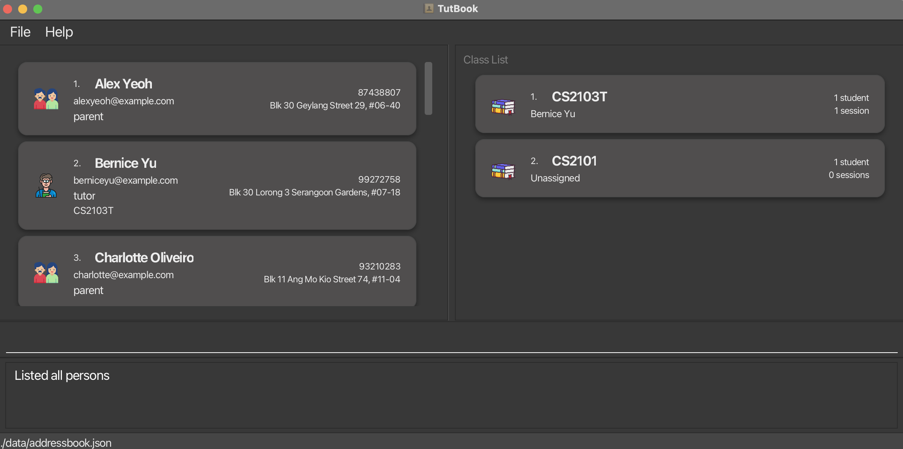
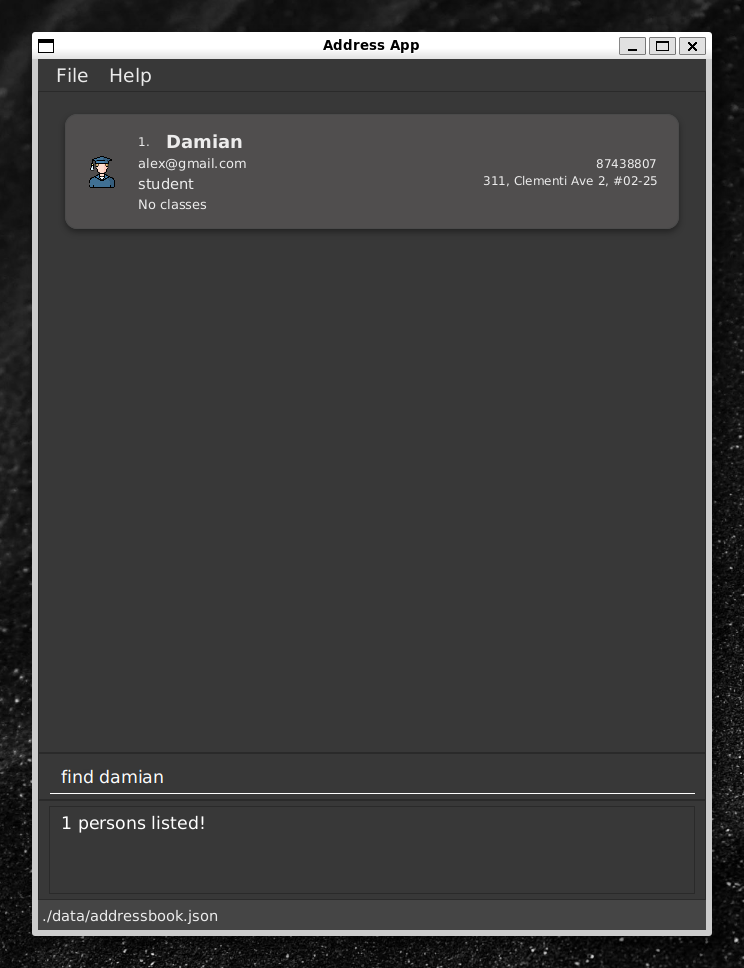

# TutBook User Guide

TutBook helps tuition centre administrators **manage students, tutors, parents, and classes efficiently**.
It combines the speed of a Command Line Interface (CLI) with the convenience of a Graphical User Interface (GUI).

This guide will help you **set up TutBook**, understand its features, and make the most out of its commands — even if you are new to CLI-based applications.

* Table of Contents
{:toc}

---

## About This Guide

This User Guide is written for **tuition centre admins** with minimal technical background.
It covers how to install TutBook, perform common tasks, and troubleshoot issues.

### Conventions Used

* Commands are shown in `monospace`.
* Parameters are in `UPPER_CASE` (e.g., `add n/NAME`).
* Square brackets `[ ]` mark optional elements.
* Ellipsis `…` means the parameter can appear multiple times.
* Tips appear in blue boxes, and cautions in yellow boxes.

---

## Getting Started

Follow these steps to set up TutBook on your computer.

1. **Install Java 17 or above.**

   **Check if you already have Java:**
   * **Windows:** Press `Win + R`, type `cmd`, press Enter. Then type `java -version`
   * **Mac:** Press `Cmd + Space`, type `terminal`, press Enter. Then type `java -version`
   * If you see "java version 17" or higher, skip to step 2

   **If you need to install Java:**
   * **Windows:** Download Windows x64 Installer from [here](https://www.oracle.com/java/technologies/javase/jdk17-archive-downloads.html)
   * **Mac:** Download macOS Installer, then follow [this guide](https://se-education.org/guides/tutorials/javaInstallationMac.html)

2. **Download TutBook.**
 Get the latest `.jar` file from the [Releases page](https://github.com/AY2526S1-CS2103T-W09-3/tp/releases).

3. **Set up your TutBook folder.**
 Copy the `.jar` file into a folder of your choice. This will be your TutBook **home folder**.

4. **Run the application.**
   * **Windows:** Press `Win + R`, type `cmd`, press Enter
   * **Mac:** Press `Cmd + Space`, type `terminal`, press Enter
   * Type `cd ` (with a space), then drag your TutBook folder into the window and press Enter
   * Type `java -jar tutbook-v1.6.jar` and press Enter

   A window like the one below should appear:
 

5. **Try a few example commands.**

* `help` — Opens the help window.
* `list` — Lists all contacts.
* `add n/John Doe p/98765432 e/johnd@example.com a/John Street ro/student` — Adds a student.
* `delete 3` — Deletes the 3rd contact.
* `exit` — Exits the app.

6. **Refer to [Features](#features)** for details on each command.

---

## User Interface Overview

 

This is the main interface of TutBook. It consists of:

* People List
* Class/Session List
  * This section switches intelligently with your command
* Command box
  * This is where you enter commands to interact with TutBook

---

## Features

### Notes on Command Format

<div markdown="block" class="alert alert-info">

**Command syntax:**

* `UPPER_CASE` → parameters (e.g. `add n/NAME`)
* `[ ]` → optional items
* `…` → can appear multiple times
* Parameters can be in any order
* Extra parameters for non-parameter commands are ignored

</div>

---

### General Commands

#### Viewing Help — `help`

Use this command to view instructions within the app.

**Format:**

```
help
```


---

### Person Management

These commands help you manage students, tutors, and parents in TutBook.

#### Adding a Person — `add`

Add a student, tutor, or parent to your contact list.

**Format:**

```
add n/NAME p/PHONE e/EMAIL a/ADDRESS ro/PERSON_TYPE [t/TAG]…
```

**Parameters:**

* `PERSON_TYPE`: `student`, `tutor`, or `parent`

<div markdown="span" class="alert alert-primary">:bulb: **Tip:**
A person can have any number of tags, including none.
</div>

<div markdown="span" class="alert alert-info">:information_source: **Note:**
Each person must have a unique name. If you have individuals with the same name but different roles (e.g., a student and parent both named "John Tan"), use suffixes or indexing to differentiate them (e.g., "John Tan Father" and "John Tan Son", or "John Tan 1" and "John Tan 2").
</div>

**Examples:**

* `add n/Ms Lim p/91234567 e/mslim@example.com a/Clementi Ave 2 ro/tutor t/experienced`
* `add n/Yi Hao p/98765432 e/johnd@example.com a/31 John Street ro/student`


---

#### Listing All Persons — `list`

Displays all persons currently stored in TutBook.

**Format:** `list`


---

#### Filtering by Role — `filter`

Focus on a specific group, such as only students or tutors.

**Format:**

```
filter ro/PERSON_TYPE
```

**Examples:**

* `filter ro/tutor` shows only tutors.
* `filter ro/student` shows only students.

<div markdown="span" class="alert alert-warning">

:exclamation: **Caution:**
Commands like `edit` and `delete` operate on the index of the **currently
displayed list**. After using `filter`, the indexes will change.
For example, `delete 1` will delete the first person in the *filtered list*, not
the first person in the main address book.

</div>


<div markdown="span" class="alert alert-primary">
:bulb: **Tip — Reset the view:**  
Use `list` anytime to return to the full contact list after filtering.
</div>

---

#### Editing a Person — `edit`

Update contact information for an existing person.

**Format:**

```
edit INDEX [n/NAME] [p/PHONE] [e/EMAIL] [a/ADDRESS] [ro/PERSON_TYPE] [t/TAG]
```

**Examples:**

* `edit 1 p/87438807 e/alex@gmail.com`
* `edit 2 n/Betsy Crower t/`

**Notes:**

* This command edits the person at the specified `INDEX`. The index refers to
the index number shown in the displayed person list. The index **must be a
positive integer** 1, 2, 3, …​
* At least one of the optional fields must be provided.
* When editing tags, the existing tags of the person will be removed i.e adding
of tags is not cumulative.
* You can remove all the person's tags by typing `t/` without
specifying any tags after it.


---

#### Finding a Person — `find`

Search for persons by name.

**Format:**

```
find KEYWORD [MORE_KEYWORDS]
```

* Case-insensitive
* Matches full words
* Returns results containing any keyword

**Examples:**

* `find David Damian` returns `David Li` and `Damian`.



---

#### Deleting a Person — `delete`

Remove a person from your contact list.

**Format:**

```
delete INDEX
```

**Examples:**

* `list` followed by `delete 2` deletes the 2nd listed person.
* `find Betsy` followed by `delete 1` deletes the 1st person in the results of the `find` command.


---

### Relationship Management

These commands help you manage relationships between parents and students.

#### Linking Parent and Child — `link`

Connects a parent to a student.

**Format:**

```
link parent/PARENT_NAME child/CHILD_NAME
```

* Both parent and child must already exist in the address book
* The parent must have the role `parent` and the child must have the role `student`
* Names are case-sensitive
* A child can have a maximum of 2 parents linked

**Examples:**

* `link parent/Bernice Yu child/Damian`


---

#### Listing Children — `childrenof`

Lists children of a specific parent.

**Format:**

```
childrenof n/PARENT_NAME
```

* Displays all students linked to the specified parent

**Examples:**

* `childrenof n/Bernice Yu`


---

#### Listing Parents — `parentsof`

Show parents of a specific child.

**Format:**

```
parentsof n/CHILD_NAME
```

**Examples:**

* `parentsof n/Damian`

---

### Class Management

These commands help you manage tuition classes and enrollment.

#### Adding a Class — `addclass`

Create a new tuition class and add to the address book.

**Format:**

```
addclass c/CLASS_NAME [tutor/TUTOR_NAME]
```

* `CLASS_NAME` can contain spaces
* `TUTOR_NAME` is optional; if provided, the tutor must already exist in the address book

**Examples:**

* `addclass c/Sec2-Math-A`
* `addclass c/CS2101 tutor/Alex Yeoh`


---

#### Listing Classes — `listclass`

Displays all classes and their enrolled students.

**Format:** `listclass`


---

#### Editing a Class — `editclass`

Rename an existing class while keeping all students and tutors.

**Format:**

```
editclass o/OLD_CLASS_NAME c/NEW_CLASS_NAME
```

**Examples:**

* `editclass o/Sec3 Math c/Sec4 Math`


---

#### Deleting a Class — `deleteclass`

Remove a class permanently.

**Format:**

```
deleteclass c/CLASS_NAME
```

**Examples:**

* `deleteclass c/Sec3-Math-A` deletes the class Sec3-Math-A


<div markdown="span" class="alert alert-warning">
:exclamation: **Caution**  
Deleting a class removes its sessions and attendance records.
</div>

---

#### Listing Students in a Class — `liststudents`

List all students enrolled in a specific class.

**Format:** `liststudents c/CLASS_NAME`

**Example:**

* `liststudents c/s3 math`


---

#### Joining a Class — `join`

Add a tutor or student to an existing class.

**Format:**

```
join n/NAME c/CLASS
```

* The person and class must already exist in the address book
* Students will be enrolled in the class
* Tutors will be assigned to teach the class

**Examples:**

* `join n/Damian c/Sec4 Math`
* `join n/Ms Lim c/Sec2-Math-A`


<div markdown="span" class="alert alert-info">
:information_source: **Role reminder:**  
Only `student` and `tutor` can join classes.  
Parents cannot be enrolled in classes.
</div>

---

#### Removing from a Class — `unjoin`

Remove a student or tutor from a class.

**Format:**

```
unjoin n/NAME c/CLASS
```

* The person must be enrolled or assigned to the class
* Works for both students and tutors

**Examples:**

* `unjoin n/Damian c/Sec4 Math`
* `unjoin n/Ms Lim c/Sec2-Math-A`


---

### Session Management

These commands help you manage class sessions and attendance tracking.

#### Adding a Session — `addsession`

Record a session for a class.

**Format:**

```
addsession c/CLASS_NAME s/SESSION_NAME dt/DATETIME [lo/LOCATION]
```

* The class must already exist
* `DATETIME` format: `YYYY-MM-DD HH:mm` (e.g., 2024-03-15 14:30)
* Location is optional
* Session names must be unique within a class

**Examples:**

* `addsession c/Math101 s/Week 3 Tutorial dt/2024-03-15 14:30 lo/COM1-B103`


<div markdown="span" class="alert alert-primary">
:bulb: **Tip — Consistent session names help tracking and attendance.**  
Example naming formats:
- Week 1, Week 2, …
- Lesson 1, Lesson 2, …
- Term1-S1, Term1-S2
</div>

---

#### Deleting a Session — `deletesession`

Remove a session and its attendance records.

**Format:**

```
deletesession c/CLASS_NAME s/SESSION_NAME
```

* The session must exist in the specified class

**Examples:**

* `deletesession c/Math101 s/Week 3 Tutorial`


---

#### Viewing a Session — `viewsession`

Check details and attendance for a class session.

**Format:**

```
viewsession c/CLASS_NAME s/SESSION_NAME
```

* Displays date, time, location and remarks for the session

**Examples:**

* `viewsession c/Physics s/Lab Session 1`


<div markdown="span" class="alert alert-primary">
:bulb: **Tip — Quickly check all sessions first:**  
Run `listsessions c/CLASS_NAME` if you're unsure about a session name.
</div>

---

#### Listing Sessions — `listsessions`

View all sessions for a class in chronological order.

**Format:**

```
listsessions c/CLASS_NAME
```

* Displays date, time, and location for each session

**Examples:**

* `listsessions c/Math101`


---

#### Marking Attendance — `attend`

Record attendance for a class session.

**Format:**

```
attend n/NAME c/CLASS_NAME s/SESSION_NAME status/STATUS
```

* The student must be enrolled in the specified class
* The session must exist in the class
* `STATUS` must be either `PRESENT` or `ABSENT`
* Attendance records can be viewed with [`viewsession`](#viewing-a-session--viewsession)

**Examples:**

* `attend n/John Doe c/Math101 s/Week 3 Tutorial status/PRESENT`


<div markdown="span" class="alert alert-info">
:information_source: **If attendance fails:**  
- Ensure the student is **enrolled** in the class using `join`  
- Ensure the session exists (`listsessions`)  
- Check spelling & capitalization of names and session titles  
</div>

---

### System Commands

#### Clearing All Data — `clear`

Deletes all data in TutBook.

**Format:** `clear`

<div markdown="span" class="alert alert-warning">:exclamation: **Caution:**
This action is **irreversible**. Please be careful when using this command.
</div>

---

#### Exiting the Program — `exit`

Closes TutBook.

**Format:** `exit`

---

### Saving and Editing Data

TutBook automatically saves your data after every change.
Files are stored in `[JAR file location]/data/addressbook.json`.

<div markdown="span" class="alert alert-warning">:exclamation: **Caution:**
If you edit the JSON file incorrectly, TutBook will reset to an empty file. Always back up before editing.
Furthermore, certain edits can cause the TutBook to behave in unexpected ways (e.g., if a value entered is outside of the acceptable range). Therefore, edit the data file only if you are confident that you can update it correctly.
</div>

---

## Command summary

### General Commands
Action | Format
--------|------------------
**Help** | `help`

### Person Management
Action | Format, Examples
--------|------------------
**Add** | `add n/NAME p/PHONE e/EMAIL a/ADDRESS ro/PERSON_TYPE [t/TAG]…​` <br> e.g., `add n/James Ho p/22224444 e/jamesho@example.com a/123, Clementi Rd, 1234665 ro/student`
**List** | `list`
**Filter** | `filter ro/PERSON_TYPE` <br> e.g., `filter ro/student`
**Edit** | `edit INDEX [n/NAME] [p/PHONE] [e/EMAIL] [a/ADDRESS] [ro/PERSON_TYPE] [t/TAGS]​` <br> e.g., `edit 2 n/James Lee e/jameslee@example.com`
**Find** | `find KEYWORD [MORE_KEYWORDS]` <br> e.g., `find James Jake`
**Delete** | `delete INDEX` <br> e.g., `delete 3`

### Relationship Management
Action | Format, Examples
--------|------------------
**Link** | `link parent/PARENT_NAME child/CHILD_NAME` <br> e.g., `link parent/John Doe child/Jane Doe`
**Children** | `childrenof n/PARENT_NAME` <br> e.g., `childrenof n/John Doe`
**List Parents** | `parentsof n/CHILD_NAME` <br> e.g., `parentsof n/Damian`

### Class Management
Action | Format, Examples
--------|------------------
**Add Class** | `addclass c/CLASS_NAME [tutor/TUTOR_NAME]` <br> e.g., `addclass c/Sec2-Math-A tutor/Ms Lim`
**List Class** | `listclass`
**Edit Class** | `editclass o/OLD_CLASS_NAME c/NEW_CLASS_NAME` <br> e.g., `editclass o/Sec2-Math-A c/Sec3-Math-A`
**Delete Class** | `deleteclass c/CLASS_NAME` <br> e.g., `deleteclass c/Sec3-Math-A`
**List Students** | `liststudents c/CLASS_NAME` <br> e.g., `liststudents c/s3 math`
**Join** | `join n/NAME c/CLASS` <br> e.g., `join n/John Doe c/Sec2-Math-A`
**Remove From** | `unjoin n/NAME c/CLASS` <br> e.g., `unjoin n/Damian c/Sec4 Math`

### Session Management
Action | Format, Examples
--------|------------------
**Add Session** | `addsession c/CLASS_NAME s/SESSION_NAME dt/DATETIME [lo/LOCATION]` <br> e.g., `addsession c/Math101 s/Week 3 Tutorial dt/2024-03-15 14:30 lo/COM1-B103`
**Delete Session** | `deletesession c/CLASS_NAME s/SESSION_NAME` <br> e.g., `deletesession c/Math101 s/Week 3 Tutorial`
**View Session** | `viewsession c/CLASS_NAME s/SESSION_NAME` <br> e.g., `viewsession c/Math101 s/Week 3 Tutorial`
**List Sessions** | `listsessions c/CLASS_NAME` <br> e.g., `listsessions c/Math101`
**Attend** | `attend n/NAME c/CLASS_NAME s/SESSION_NAME status/STATUS` <br> e.g., `attend n/John Doe c/Math101 s/Week 3 Tutorial status/PRESENT`

### System Commands
Action | Format
--------|------------------
**Clear** | `clear`
**Exit** | `exit`

---

## Troubleshooting

| Problem | Possible Cause | Solution |
|----------|----------------|-----------|
| `link` command fails | Wrong roles | Check spelling; ensure parent/child roles are correct |
| GUI opens off-screen | Moved app between displays | Delete `preferences.json` before restarting |
| `help` window not appearing | Window minimized | Restore manually from taskbar |
| App fails to start | Java not installed | Install Java 17 or above |

---

## FAQ

**Q:** How do I transfer my data to another computer?
**A:** Install TutBook on the new computer and replace its empty data file with your saved `addressbook.json` from the old system.

**Q:** Can I undo a delete or clear command?
**A:** No. Destructive commands are irreversible.

**Q:** Can I try the app without fully committing to it?
**A:** Yes, [sample data](./sample-data/README.md) is pre-loaded for you to explore features. Use the `clear` command to start fresh.

---

*TutBook v1.6 - Empowering tuition centre management through simplicity and speed.*
